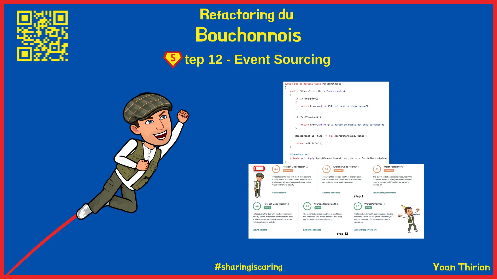

# "Event Sourcing"


Nous avons des `ersatzs` d'événements au sein de notre `PartieDeChasse`.

Ceux-ci sont extrêmement limités :
- ils ne portent aucune sémantique métier
- pas structurés : ce sont de simples `string`

```csharp
private readonly List<Event> _events;
public sealed record Event(DateTime Date, string Message)
{
    public override string ToString() => string.Format("{0:HH:mm} - {1}", Date, Message);
}

if (TousBrocouilles(classement))
{
    result = "Brocouille";
    EmitEvent("La partie de chasse est terminée, vainqueur : Brocouille", timeProvider);
}
else
{
    result = Join(", ", classement[0].Select(c => c.Nom));
    EmitEvent(
        $"La partie de chasse est terminée, vainqueur : {Join(", ", classement[0].Select(c => $"{c.Nom} - {c.NbGalinettes} galinettes"))}",
        timeProvider);
}
```

On va revoir cette gestion des événements et allons en profiter pour `Event-sourcer` notre `Aggregate`. Celà signifie que nous n'allons plus stocker l'état de notre `Aggregate` mais tous ses événements.

Pour celà, on va :
- Prendre du temps pour découvrir ce qu'est l'[`Event Sourcing`](https://martinfowler.com/eaaDev/EventSourcing.html)
- Quelques classes ont déjà été implémenté afin de faciliter l'utilisation d'1 `Event Store` in memory
    - Faire 1 `checkout` du commit `6efde7c3e470e7c84c50da2715c255bd9acd3d6c`

```shell
git checkout 5b3129f2bc384ccc707b3f6bb730ff2ef9999167
```

- Cette version est très minimaliste et ne résolve pas des problématiques telles que la concurrence
- Prendre du temps pour comprendre le code du `Domain.Core`
    - Ce code est fortement inspiré du travail fait sur [`NEventStore`](https://github.com/NEventStore/NEventStore)
    - Pour comprendre comment utiliser ce code, on peut se focaliser sur les tests qui nous en donnent une bonne idée

```csharp
[Fact]
public class AggregateShould
{
    private readonly Guid _id;
    private readonly Movie _movie;

    public AggregateShould()
    {
        _id = Guid.NewGuid();
        _movie = Oppenheimer.Movie(_id);
    }

    [Fact]
    public void have_raised_creation_event()
    {
        _movie.HasRaisedEvent(new MovieCreated(_id, Data.Now, Oppenheimer.Title, Oppenheimer.ReleaseDate))
            .Should()
            .BeTrue();
        _movie.Version.Should().Be(1);
        _movie.Id.Should().Be(_id);
    }

    [Fact]
    public void have_raised_casting_changed_event()
    {
        var newCasting = new List<string> {"Cillian Murphy", "Florence Pugh"}.ToSeq();

        _movie.ChangeCast(newCasting);

        _movie.HasRaisedEvent(new CastingHasChanged(_id, Data.Now, newCasting))
            .Should()
            .BeTrue();

        _movie.Version.Should().Be(2);
    }

    [Fact]
    public void throw_handler_not_found_when_apply_method_not_defined()
    {
        var act = () => _movie.NotWellImplementedBehavior();
        act.Should()
            .Throw<HandlerForDomainEventNotFoundException>()
            .WithMessage(
                "Aggregate of type 'Movie' raised an event of type 'NotWellImplementedDomainBehaviorRaised' but no handler could be found to handle the event.");
    }
    ...
}

public class Movie : Aggregate
{
    // public only for testing purpose
    public string? _title;
    public DateTime? _releaseDate;
    public Seq<string> _casting = Seq<string>.Empty;
    private Movie(Guid id, Func<DateTime> timeProvider) : base(timeProvider, true) => Id = id;

    public Movie(Guid id, Func<DateTime> timeProvider, string title, DateTime releaseDate) : this(id, timeProvider)
        => RaiseEvent(new MovieCreated(id, Time(), title, releaseDate));

    private void Apply(MovieCreated @event)
    {
        _title = @event.Title;
        _releaseDate = @event.ReleaseDate;
    }

    public void ChangeCast(Seq<string> casting) => RaiseEvent(new CastingHasChanged(Id, Time(), casting));

    private void Apply(CastingHasChanged @event) => _casting = @event.Casting;

    public void NotWellImplementedBehavior() => RaiseEvent(new NotWellImplementedDomainBehaviorRaised(Id, Time()));
}

public record MovieCreated(Guid Id, DateTime Date, string Title, DateTime ReleaseDate) : Event(Id, 1, Date);

public record CastingHasChanged(Guid Id, DateTime Date, Seq<string> Casting) : Event(Id, 1, Date);

public record NotWellImplementedDomainBehaviorRaised(Guid Id, DateTime Date) : Event(Id, 1, Date);
```

- Identifier quels sont les éléments fondamentaux à mettre en place pour avoir 1 `Aggregate` "Event-Sourcé"

## Changer l'implémentation de `Prendre LApéro`
Faire en sorte que le flux ressemble à celà :


- Pour le moment au sein de notre `Domain` son implémentation ressemble à ça :

```csharp
public Either<Error, PartieDeChasse> PrendreLapéro(Func<DateTime> timeProvider)
{
    if (DuringApéro())
    {
        return AnError("On est déjà en plein apéro");
    }

    if (DéjàTerminée())
    {
        return AnError("La partie de chasse est déjà terminée");
    }

    Status = Apéro;
    EmitEvent("Petit apéro", timeProvider);

    return this;
}
```

- Soyons plus explicite en retournant `Either<Error, Unit>`
    - On ne stockera plus l'état mais que les `Events` donc plus besoin de retourner le nouvel état de l'objet

À toi de jouer maintenant 😉

## Reflect
- Qu'est-ce que celà a simplifié ?
- Au contraire complexifié ?
- Qu'est ce que tu en penses ?
  


## Solution
Guide étape par étape disponible [ici](steps/12.event-sourcing.md).