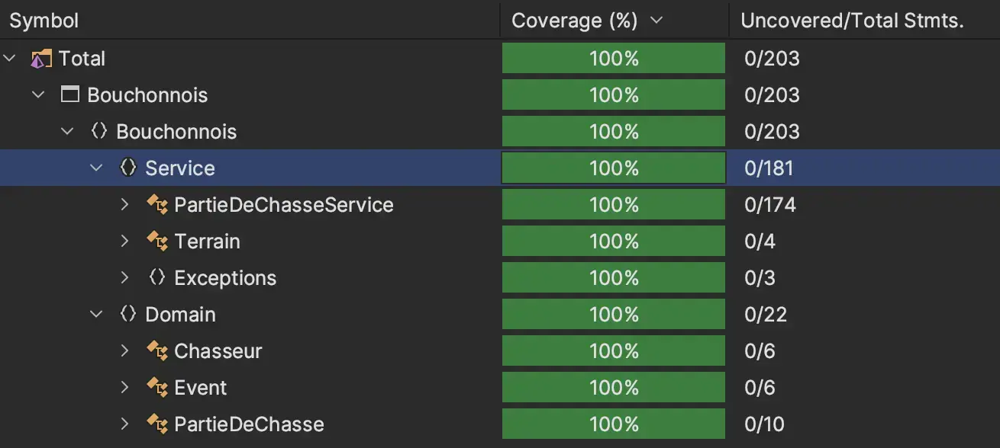
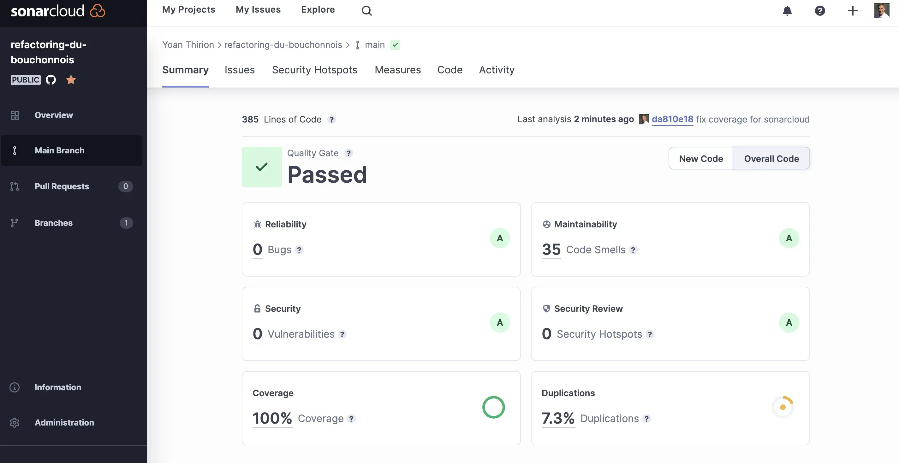
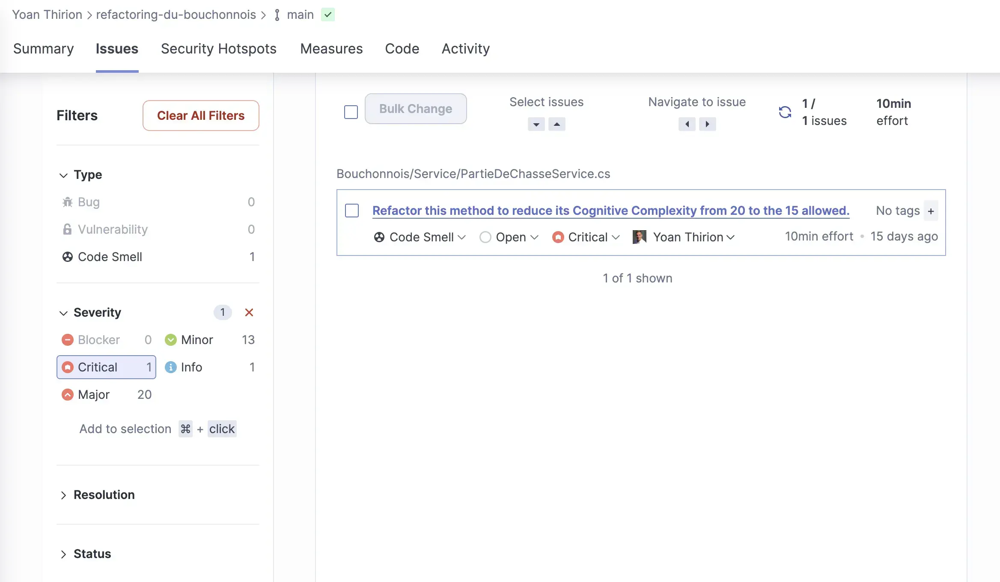
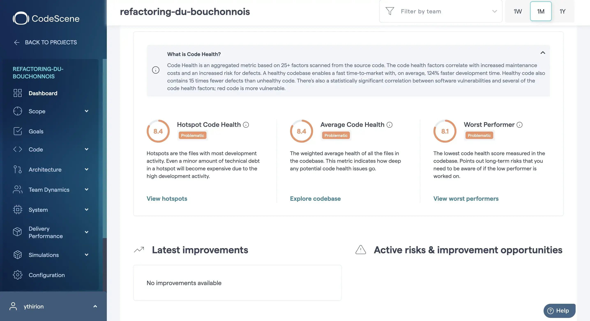
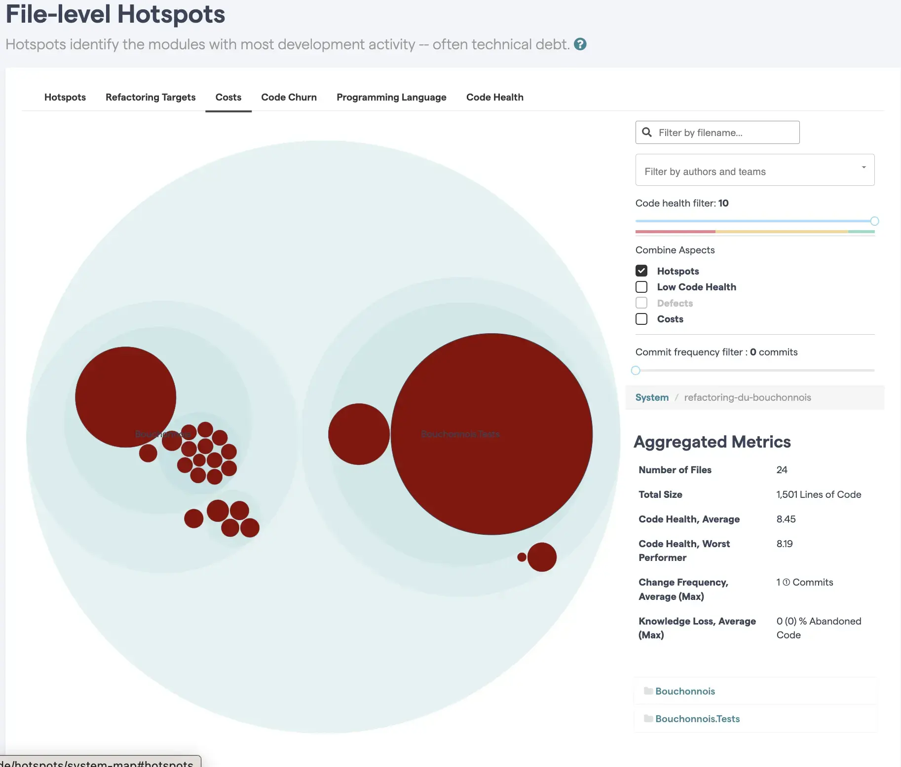
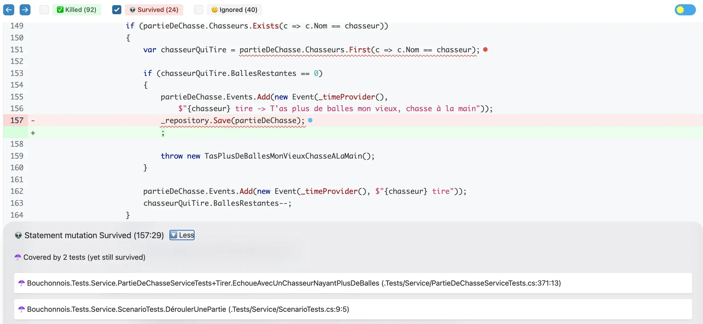

# Se faire une idée de la code base
Imagine que tu dois reprendre la maintenance évolutive du système de gestion des parties de chasse de nos chers chasseurs du bouchonnois.

Afin de te faire un premier feeling sur le code, on va analyser certains éléments factuels.

## Check-list
On dresse une check-list de choses à vérifier / analyser :
- [ ] Compiler afin de valider qu'on est en capacité de compiler / exécuter le code
  - Analyser les potentiels `Warning` à la compilation
- [ ] Analyser la structure de la solution afin de comprendre l'architecture en place
- [ ] Regarder quels packages sont référencés afin de comprendre les interactions potentielles du système

### Récolter des metrics
Nos outils et l'écosystème de développement nous permet de récolter rapidement des metrics permettant d'observer de manière assez factuelle la qualité du code :
- [ ] Récupérer le `code coverage` 
- [ ] Mettre en place un outil d'analyse static de code
- [ ] Utiliser un Linter
- [ ] Identifier s'il y a des [`hotspots`](https://understandlegacycode.com/blog/focus-refactoring-with-hotspots-analysis/) et où ils sont localisés
- [ ] Revue de la qualité des tests

## Compiler
Lancer une première compilation afin d'identifier de potentiels problèmes.


On a déjà une première boucle de feedback de la part de notre compilateur nous indiquant que certains `fields` sont déclarés comme `non-nullable` mais pas initialisés.

## Analyser la structure
La structure d'une solution / projet est un indicateur de l'architecture sous-jacente.
L'observer nous permet de comprendre a minima le design du système.

Pour en savoir plus : [Screaming Architecture](https://blog.cleancoder.com/uncle-bob/2011/09/30/Screaming-Architecture.html).


Ici on peut tout de suite comprendre plusieurs éléments :
- Bonne nouvelle !!! la solution comprend des tests automatisés
- Le projet `Bouchonnois` semble être organisé autour d'un `Domain Model`
  - Une abstraction de repository semble servir de `port`
  - Le service `PartieDeChasseService` doit être le point d'entrée du système
  - Que fait la classe `Terrain` dans le répertoir `Service` ?
- Il y a une gestion d'Exceptions métiers et non pas des exceptions génériques

## Analyser les références
On jette un oeil sur les packages référencés afin de comprendre si le système intéragit avec d'autres systèmes (via gRPC, REST API, Integration Bus, Cloud Services, ...)


A part les références au framework, aucune dépendance n'est "exotique".
Les seuls packages utilisés sont ceux pour les tests.

## Code Coverage
On lance nos tests en activant le `code coverage`:


Super nouvelle !!! on a du code source couvert à 100%.  
Est-ce que celà suffit pour nous rendre complètement confiant vis-à-vis de nos futurs refactorings ?

## Analyse static de code
Nous allons dès maintenant mettre en place un outil d'analyse static de code ([SonarCloud](https://www.sonarsource.com/products/sonarcloud/) ici) et automatiser son lancement via notre chaine de build.
Celà nous permettra tout au long de l'atelier de vérifier l'impact de nos améliorations sur le code.

En utilisant `github` on peut profiter des `github actions` pour ce faire:

```yaml
name: SonarCloud
on:
  push:
    branches:
      - main
      - steps/01-gather-metrics
jobs:
  build:
    name: Build and analyze
    runs-on: windows-latest
    steps:
      - name: Set up JDK 11
        uses: actions/setup-java@v3
        with:
          java-version: 11
          distribution: 'zulu' # Alternative distribution options are available.
      - uses: actions/checkout@v3
        with:
          fetch-depth: 0  # Shallow clones should be disabled for a better relevancy of analysis
      - name: Cache SonarCloud packages
        uses: actions/cache@v3
        with:
          path: ~\sonar\cache
          key: ${{ runner.os }}-sonar
          restore-keys: ${{ runner.os }}-sonar
      - name: Cache SonarCloud scanner
        id: cache-sonar-scanner
        uses: actions/cache@v3
        with:
          path: .\.sonar\scanner
          key: ${{ runner.os }}-sonar-scanner
          restore-keys: ${{ runner.os }}-sonar-scanner
      - name: Install SonarCloud scanner
        if: steps.cache-sonar-scanner.outputs.cache-hit != 'true'
        shell: powershell
        run: |
          New-Item -Path .\.sonar\scanner -ItemType Directory
          dotnet tool update dotnet-sonarscanner --tool-path .\.sonar\scanner
      - name: Build and analyze
        env:
          GITHUB_TOKEN: ${{ secrets.GITHUB_TOKEN }}
          SONAR_TOKEN: ${{ secrets.SONAR_TOKEN }}
        shell: powershell
        run: |
          // On lance l'analyse 
          dotnet tool install --global dotnet-coverage
          .\.sonar\scanner\dotnet-sonarscanner begin /k:"ythirion_refactoring-du-bouchonnois" /o:"ythirion" /d:sonar.login="${{ secrets.SONAR_TOKEN }}" /d:sonar.host.url="https://sonarcloud.io" /d:sonar.cs.vscoveragexml.reportsPaths=coverage.xml
          dotnet build
          // On ajoute le rapport de coverage
          dotnet-coverage collect "dotnet test" -f xml -o "coverage.xml"
          .\.sonar\scanner\dotnet-sonarscanner end /d:sonar.login="${{ secrets.SONAR_TOKEN }}"
```

Après un premier lancement on obtient ce dashboard.


D'après l'outil la solution est plutôt en bonne santé:
- 35 code smells
- 100% de coverage
- MAIS 7.3% de duplication


Il y a 1 code smell qualifié de `critical` qui doit attirer notre attention.
En effet, la complexité cyclomatique de la classe `PartieDeChasseService` est très élevée.

Une méthode a une complexité de 20... 

Cette classe est un service qui ne devrait avoir qu'une logique d'orchestration:
- Charger 1 `Aggregate` depuis son repository
- Appeler la méthode métier sur cet `Aggregate`
- Sauver le nouvel état à l'aide du même repository

On peut alors catégoriser le code de cette manière:


Ainsi, on peut voir :
- les classes actuellement dans notre `Domain` sont complètement anémiques : ne comprennent aucun comportement
- le service `PartieDeChasseService` contient des comportements qui devraient être dans le Domain

## Linter
Afin d'avoir le feedback de l'analyse static de code dans notre `IDE` on peut installer le plugin [`sonarlint`](https://www.sonarsource.com/products/sonarlint/#:~:text=SonarLint%20helps%20developers%20of%20all,and%20learn%20along%20the%20way).
Le linter nous fournira le même feedback que `SonarCloud` mais sans avoir à lancer une analyse complète.


On peut le configurer afin de le "binder" avec notre projet dans `sonarcloud` afin que l'analyse en local se fasse avec le même set de règles que dans la version cloud.
Pour celà il suffit de suivre la documentation disponible [ici](https://github.com/SonarSource/sonarlint-intellij/wiki/Bind-to-SonarQube-or-SonarCloud).

## Hotspots
On va utiliser `codescene`, une plate-forme faisant à la fois de l'analyse static de code mais également de l'analyse "comportementale" du code permettant de :
- Identifier de potentiels `hotspots`
- Comprendre la diffusion de la connaissance sur une code base donnée
- Identifier du couplage temporel
- ...

Après avoir lancé une première analyse on a déjà quelques indications sur la santé globale de notre code d'après cet outil...


On va mettre l'accent sur les `hotspots` pour identifier où sont les morceaux de code à problèmes.


Comme illustré ci-dessus, les hotspots sont des morceaux de code complexes qui ont tendance à être modifiés de manière très régulière...


Il apparait que nous avons 2 hotspots dans la solution : 
- `PartieDeChasseService`
- `PartieDeChasseServiceTests` et ses 1131 lignes de code

## Badges
Lorsque l'on utilise des outils, il est important de rendre visible les "choses".
Nous allons donc faire en sorte que le résultat de nos outils d'analyse (sonarcloud et codescene) soient visibles à l'ouverture du fichier `README` en ajoutant des badges dans le `markdown`.

```markdown
[](https://sonarcloud.io/summary/new_code?id=ythirion_refactoring-du-bouchonnois) 
[](https://sonarcloud.io/summary/new_code?id=ythirion_refactoring-du-bouchonnois) 
[](https://sonarcloud.io/summary/new_code?id=ythirion_refactoring-du-bouchonnois) 
[](https://sonarcloud.io/summary/new_code?id=ythirion_refactoring-du-bouchonnois) 
[](https://codescene.io/projects/39213) 
[](https://codescene.io/projects/39213)	
```

## Revue de la qualité des tests
Nous avons vu précédemment que le coverage est à 100% sur cette solution.
Mais qu'en est-il de leur qualité ?

C'est ce qu'on va vérifier en lançant une analyse à l'aide de `stryker`.
C'est un outil de [mutation testing](https://xtrem-tdd.netlify.app/Flavours/mutation-testing) signifiant qu'il va créer des versions mutantes de notre code de production et vérifier que les tests vont bien identifier ces mutants (au moins 1 test doit échouer pour chaque mutant généré).

Pour le lancer, il suffit d'installer `stryker` puis de l'exécuter:
```shell
dotnet tool install -g dotnet-stryker
dotnet stryker
```

Voici le résultat du lancement de stryker:
[](img/01.gather-metrics/mutation-report.html)

Intéressant, malgré nos 100% de code coverage on obtient un score de mutation qui est autour de `79%`...
Celà signifie que notre `file de sécurité` ne nous couvre pas aussi bien qu'escompté.

Si on analyse le mutant ci-dessous, on voit que stryker a retiré certains appels.


On peut alors comprendre que certains `side-effects` du service ne sont pas toujours validés par nos tests:
- Appelle à la méthode `Save` du repository
- Ajout d'événements dans la `PartieDeChasse`
- ...

Il va y avoir un petit peu de travail au niveau de nos tests afin d'améliorer leur couverture réelle.

> Pour revenir sur le code coverage, c'est un excellent indicateur négatif (avoir 0% de coverage montre qu'il y a un effort à fournir) mais un mauvais positif (avoir 100% ne signifie qu'on peut être confiant vis-à-vis de notre filet de sécurité).

## Reflect
- [x] Compiler afin de valider qu'on est en capacité de compiler / exécuter le code
  - Analyser les potentiels `Warning` à la compilation
- [x] Analyser la structure de la solution afin de comprendre l'architecture en place
- [x] Regarder quels packages sont référencés afin de comprendre les interactions potentielles du système
- [x] Récupérer le `code coverage` 
- [x] Mettre en place un outil d'analyse static de code
- [x] Utiliser un Linter
- [x] Identifier s'il y a des [`hotspots`](https://understandlegacycode.com/blog/focus-refactoring-with-hotspots-analysis/) et où ils sont localisés
- [x] Revue de la qualité des tests

A l'aide de ces éléments nous avons pu identifier certains axes d'amélioration :
- Fixer les `warnings` de compilation
  - Mettre en place une politique : `0 tolérance aux warnings`
- Améliorer les tests afin d'atteindre un score de mutation proche des 100%
- Splitter le service `PartieDeChasseService`
  - Mettre le comportement business dans le `Domain`
  - Rendre le `Domain` riche et non plus anémique
  - Le décomposer : 1 classe par comportement (handlers)
- Eliminer les `code smells` idenfiés par `sonar`
  - Fait au fur et à mesure