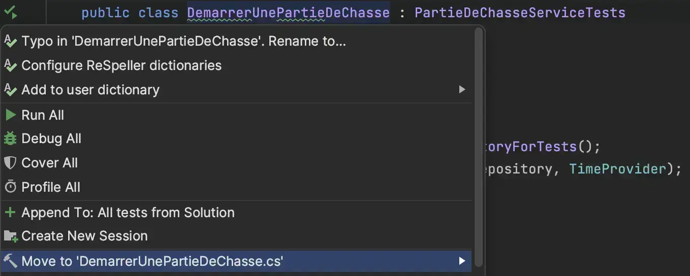
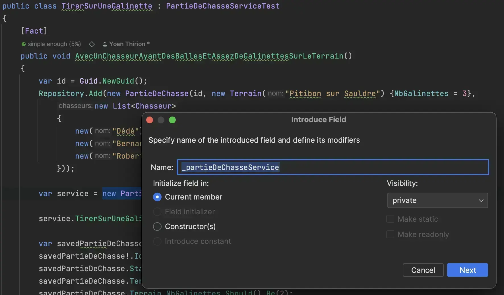
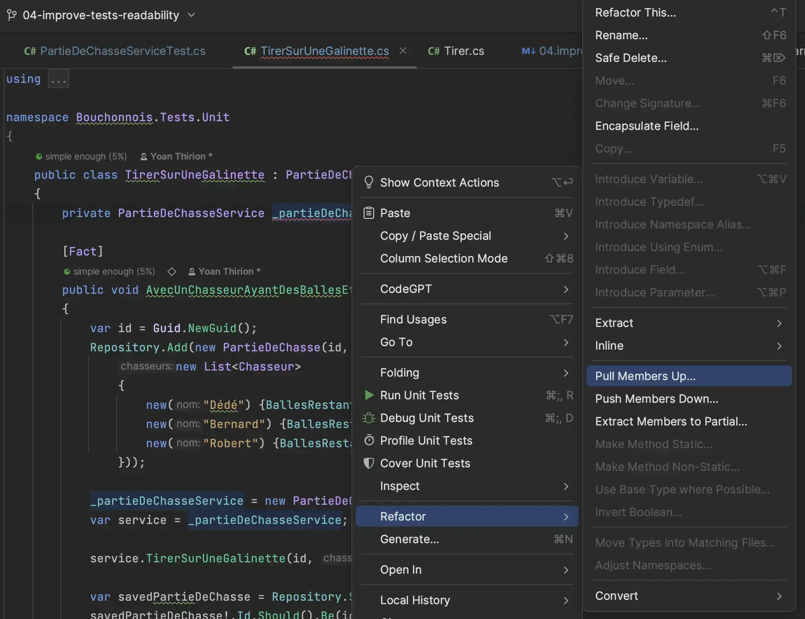
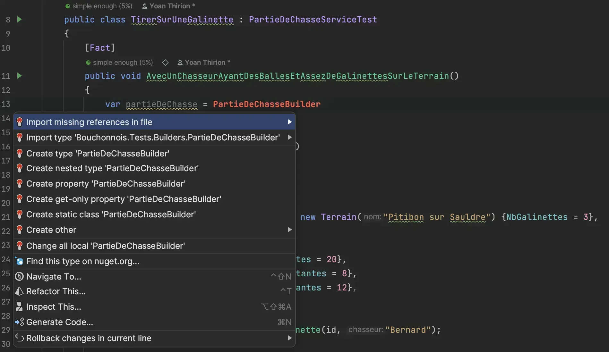

# Améliorer la lisibilité des tests
Les tests sont, pour l'instant, assez difficiles à comprendre :
- 1 classe de tests avec `948 loc`
- Il y a de la duplication partout
- Ce qui influe le résultat du test n'est pas mis en évidence


Prenons un exemple pour illustrer cela :
```csharp
public class TirerSurUneGalinette
{
    [Fact]
    public void AvecUnChasseurAyantDesBallesEtAssezDeGalinettesSurLeTerrain()
    {
        // Début duplication 1
        var id = Guid.NewGuid();
        var repository = new PartieDeChasseRepositoryForTests();

        repository.Add(new PartieDeChasse(id, new Terrain("Pitibon sur Sauldre") {NbGalinettes = 3},
            new List<Chasseur>
            {
                new("Dédé") {BallesRestantes = 20},
                new("Bernard") {BallesRestantes = 8},
                new("Robert") {BallesRestantes = 12},
            }));

        var service = new PartieDeChasseService(repository, TimeProvider);
        // Fin duplication 1

        service.TirerSurUneGalinette(id, "Bernard");

        // Début duplication 2
        var savedPartieDeChasse = repository.SavedPartieDeChasse();
        savedPartieDeChasse!.Id.Should().Be(id);
        savedPartieDeChasse.Status.Should().Be(PartieStatus.EnCours);
        savedPartieDeChasse.Terrain.Nom.Should().Be("Pitibon sur Sauldre");
        savedPartieDeChasse.Terrain.NbGalinettes.Should().Be(2);
        // Ce qui devrait être mis en avant 1
        // Tirer sur une Galinette diminue le nombre de galinettes restantes sur le terrain
        savedPartieDeChasse.Chasseurs.Should().HaveCount(3);
        savedPartieDeChasse.Chasseurs[0].Nom.Should().Be("Dédé");
        savedPartieDeChasse.Chasseurs[0].BallesRestantes.Should().Be(20);
        savedPartieDeChasse.Chasseurs[0].NbGalinettes.Should().Be(0);
        savedPartieDeChasse.Chasseurs[1].Nom.Should().Be("Bernard");
        
        // Ce qui devrait être mis en avant 2
        // 1 balle en moins et 1 galinette pour Bernard
        savedPartieDeChasse.Chasseurs[1].BallesRestantes.Should().Be(7);
        savedPartieDeChasse.Chasseurs[1].NbGalinettes.Should().Be(1);
        
        savedPartieDeChasse.Chasseurs[2].Nom.Should().Be("Robert");
        savedPartieDeChasse.Chasseurs[2].BallesRestantes.Should().Be(12);
        savedPartieDeChasse.Chasseurs[2].NbGalinettes.Should().Be(0);
        // Fin duplication 2

        AssertLastEvent(savedPartieDeChasse, "Bernard tire sur une galinette");
    }
    ...
    
public class Tirer
{
    [Fact]
    public void AvecUnChasseurAyantDesBalles()
    {
        // Début duplication 1
        var id = Guid.NewGuid();
        var repository = new PartieDeChasseRepositoryForTests();

        repository.Add(new PartieDeChasse(id, new Terrain("Pitibon sur Sauldre") {NbGalinettes = 3},
            new List<Chasseur>
            {
                new("Dédé") {BallesRestantes = 20},
                new("Bernard") {BallesRestantes = 8},
                new("Robert") {BallesRestantes = 12},
            }));

        var service = new PartieDeChasseService(repository, TimeProvider);
        // Fin duplication 1
        
        service.Tirer(id, "Bernard");

        // Début duplication 2
        var savedPartieDeChasse = repository.SavedPartieDeChasse();
        savedPartieDeChasse!.Id.Should().Be(id);
        savedPartieDeChasse.Status.Should().Be(PartieStatus.EnCours);
        savedPartieDeChasse.Terrain.Nom.Should().Be("Pitibon sur Sauldre");
        savedPartieDeChasse.Terrain.NbGalinettes.Should().Be(3);
        savedPartieDeChasse.Chasseurs.Should().HaveCount(3);
        savedPartieDeChasse.Chasseurs[0].Nom.Should().Be("Dédé");
        savedPartieDeChasse.Chasseurs[0].BallesRestantes.Should().Be(20);
        savedPartieDeChasse.Chasseurs[0].NbGalinettes.Should().Be(0);
        savedPartieDeChasse.Chasseurs[1].Nom.Should().Be("Bernard");
        // Ce qui devrait être mis en avant
        // 1 balle en moins pour Bernard
        savedPartieDeChasse.Chasseurs[1].BallesRestantes.Should().Be(7);
        savedPartieDeChasse.Chasseurs[1].NbGalinettes.Should().Be(0);
        savedPartieDeChasse.Chasseurs[2].Nom.Should().Be("Robert");
        savedPartieDeChasse.Chasseurs[2].BallesRestantes.Should().Be(12);
        savedPartieDeChasse.Chasseurs[2].NbGalinettes.Should().Be(0);
        // Fin duplication 2

        AssertLastEvent(repository.SavedPartieDeChasse()!, "Bernard tire");
    }
}
```

## Splitter la classe de tests
- On commence par déplacer les classes de test à l'extérieur de `PartieDeChasseServiceTests`
- Chaque classe de test va maintenant hériter de `PartieDeChasseServiceTests`
- On change l'accessibilité (`protected`) de `TimeProvider` et `AssertLastEvent`

```csharp
public abstract class PartieDeChasseServiceTests
{
    private static readonly DateTime Now = new(2024, 6, 6, 14, 50, 45);
    protected static readonly Func<DateTime> TimeProvider = () => Now;

    protected static void AssertLastEvent(PartieDeChasse partieDeChasse,
        string expectedMessage)
        => partieDeChasse.Events.Should()
            .HaveCount(1)
            .And
            .EndWith(new Event(Now, expectedMessage));
}

public class DemarrerUnePartieDeChasse : PartieDeChasseServiceTests
{
    ...
}
```

- On peut ensuite sortir chaque classe de tests dans son propre fichier de manière `safe`



- On se retrouve alors avec une hiérarchie de tests comme suit


- On en profite pour séparer les tests unitaires et le test d'acceptation


- On peut aller plus loin en séparant dans chaque fichier les cas `passants` et `non-passants` 

```csharp
public class ReprendreLaPartieDeChasse : PartieDeChasseServiceTests
{
    // Cas passants
    [Fact]
    public void QuandLapéroEstEnCours()
    {
        ...
    }

    // Cas non passants
    public class Echoue
    {
        // Se lit de la manière suivante : ReprendreLaPartieDeChasse_Echoue_CarPartieNexistePas
        [Fact]
        public void CarPartieNexistePas()
        {
            ...
        }

        [Fact]
        public void SiLaChasseEstEnCours()
        {
            ...
        }

        [Fact]
        public void SiLaPartieDeChasseEstTerminée()
        {
            ...
        }
    }
}
```

## Utiliser des `Test Data Builders`
Prenez le temps de découvrir le `pattern` expliqué [ici](https://xtrem-tdd.netlify.app/Flavours/test-data-builders).
On va commencer à modifier un premier test en utilisant le pattern et en faisant ressortir ce qui influe sur le résultat du test.

Pour cela on identifie les pré-requis ci-dessous:

```csharp
[Fact]
public void AvecUnChasseurAyantDesBalles()
{
    // Cacher cela dans le builder
    var id = Guid.NewGuid();
    // Centraliser l'instantiation du repository et du service
    var repository = new PartieDeChasseRepositoryForTests();

    // Exprimer la création de la Partie de Chasse de manière plus textuelle
    // Supprimer les données non "vitales" pour la compréhension du test
    repository.Add(new PartieDeChasse(id, new Terrain("Pitibon sur Sauldre") {NbGalinettes = 3},
        new List<Chasseur>
        {
            new("Dédé") {BallesRestantes = 20},
            new("Bernard") {BallesRestantes = 8},
            new("Robert") {BallesRestantes = 12},
        }));

    var service = new PartieDeChasseService(repository, TimeProvider);

    service.Tirer(id, "Bernard");

    var savedPartieDeChasse = repository.SavedPartieDeChasse();
    savedPartieDeChasse!.Id.Should().Be(id);
    savedPartieDeChasse.Status.Should().Be(PartieStatus.EnCours);
    savedPartieDeChasse.Terrain.Nom.Should().Be("Pitibon sur Sauldre");
    savedPartieDeChasse.Terrain.NbGalinettes.Should().Be(3);
    savedPartieDeChasse.Chasseurs.Should().HaveCount(3);
    savedPartieDeChasse.Chasseurs[0].Nom.Should().Be("Dédé");
    savedPartieDeChasse.Chasseurs[0].BallesRestantes.Should().Be(20);
    savedPartieDeChasse.Chasseurs[0].NbGalinettes.Should().Be(0);
    savedPartieDeChasse.Chasseurs[1].Nom.Should().Be("Bernard");
    savedPartieDeChasse.Chasseurs[1].BallesRestantes.Should().Be(7);
    savedPartieDeChasse.Chasseurs[1].NbGalinettes.Should().Be(0);
    savedPartieDeChasse.Chasseurs[2].Nom.Should().Be("Robert");
    savedPartieDeChasse.Chasseurs[2].BallesRestantes.Should().Be(12);
    savedPartieDeChasse.Chasseurs[2].NbGalinettes.Should().Be(0);

    AssertLastEvent(repository.SavedPartieDeChasse()!, "Bernard tire");
}
```

### Centraliser l'instantiation du Service / Repository
- On commence par extraire des `Fields` à partir du test



- Ensuite on remonte les champs dans la class de base



```csharp
public abstract class PartieDeChasseServiceTest
{
    private static readonly DateTime Now = new(2024, 6, 6, 14, 50, 45);
    protected static readonly Func<DateTime> TimeProvider = () => Now;

    protected readonly PartieDeChasseRepositoryForTests Repository;
    protected readonly PartieDeChasseService PartieDeChasseService;

    protected PartieDeChasseServiceTest()
    {
        Repository = new PartieDeChasseRepositoryForTests();
        PartieDeChasseService = new PartieDeChasseService(Repository, TimeProvider);
    }

    protected static void AssertLastEvent(PartieDeChasse partieDeChasse,
        string expectedMessage)
        => partieDeChasse.Events.Should()
            .HaveCount(1)
            .And
            .EndWith(new Event(Now, expectedMessage));
}

public class TirerSurUneGalinette : PartieDeChasseServiceTest
{
    [Fact]
    public void AvecUnChasseurAyantDesBallesEtAssezDeGalinettesSurLeTerrain()
    {
        var id = Guid.NewGuid();
        Repository.Add(new PartieDeChasse(id, new Terrain("Pitibon sur Sauldre") {NbGalinettes = 3},
            new List<Chasseur>
            {
                new("Dédé") {BallesRestantes = 20},
                new("Bernard") {BallesRestantes = 8},
                new("Robert") {BallesRestantes = 12},
            }));

        PartieDeChasseService.TirerSurUneGalinette(id, "Bernard");

        var savedPartieDeChasse = Repository.SavedPartieDeChasse();
        savedPartieDeChasse!.Id.Should().Be(id);
        savedPartieDeChasse.Status.Should().Be(PartieStatus.EnCours);
        savedPartieDeChasse.Terrain.Nom.Should().Be("Pitibon sur Sauldre");
        savedPartieDeChasse.Terrain.NbGalinettes.Should().Be(2);
        savedPartieDeChasse.Chasseurs.Should().HaveCount(3);
        savedPartieDeChasse.Chasseurs[0].Nom.Should().Be("Dédé");
        savedPartieDeChasse.Chasseurs[0].BallesRestantes.Should().Be(20);
        savedPartieDeChasse.Chasseurs[0].NbGalinettes.Should().Be(0);
        savedPartieDeChasse.Chasseurs[1].Nom.Should().Be("Bernard");
        savedPartieDeChasse.Chasseurs[1].BallesRestantes.Should().Be(7);
        savedPartieDeChasse.Chasseurs[1].NbGalinettes.Should().Be(1);
        savedPartieDeChasse.Chasseurs[2].Nom.Should().Be("Robert");
        savedPartieDeChasse.Chasseurs[2].BallesRestantes.Should().Be(12);
        savedPartieDeChasse.Chasseurs[2].NbGalinettes.Should().Be(0);

        AssertLastEvent(savedPartieDeChasse, "Bernard tire sur une galinette");
    }
    ....
```

On peut dès lors refactorer l'ensemble des tests et réduire la duplication.

### Écrire son premier `Test Data Builder`
- On commence par écrire de manière textuelle ce qu'on souhaite pour instancier la `PartieDeChasse`


- Ensuite on peut générer le code à partie de notre `IDE`
  - Voir [`Generate Code From Usage`](https://xtrem-tdd.netlify.app/Flavours/generate-code-from-usage)



- On dévéloppe les méthodes du `Builder`


```csharp
internal class PartieDeChasseBuilder
{
    // Le Builder contient les même fields que l'objet à instancier
    private int _nbGalinettes;
    private ChasseurBuilder[] _chasseurs = Array.Empty<ChasseurBuilder>();

    // Factory method
    public static PartieDeChasseBuilder UnePartieDeChasseDuBouchonnois() => new();

    public PartieDeChasseBuilder SurUnTerrainRicheEnGalinettes(int nbGalinettes = 3)
    {
        _nbGalinettes = nbGalinettes;
        return this;
    }

    public PartieDeChasseBuilder Avec(params ChasseurBuilder[] chasseurs)
    {
        _chasseurs = chasseurs;
        return this;
    }

    // Méthode Build() permettant d'instancier la PartieDeChasse
    public PartieDeChasse Build() => new(
        Guid.NewGuid(),
        new Terrain("Pitibon sur Sauldre") {NbGalinettes = _nbGalinettes},
        _chasseurs.Select(c => c.Build()).ToList()
    );
}
```

- On écrit également le `ChasseurBuilder`
  - On peut mélanger `Builder` et [`Object Mother`](https://martinfowler.com/bliki/ObjectMother.html)

```csharp
internal class ChasseurBuilder
{
    private string? _nom;
    private int _ballesRestantes;
    private int _nbGalinettes;

    public ChasseurBuilder(string nom) => _nom = nom;

    private ChasseurBuilder(string nom, int ballesRestantes)
    {
        _nom = nom;
        _ballesRestantes = ballesRestantes;
    }

    // Object mothers
    public static ChasseurBuilder Dédé() => new ChasseurBuilder("Dédé", 20);
    public static ChasseurBuilder Bernard() => new ChasseurBuilder("Bernard", 8);
    public static ChasseurBuilder Robert() => new ChasseurBuilder("Robert", 12);

    public Chasseur Build() => new(_nom!) {BallesRestantes = _ballesRestantes, NbGalinettes = _nbGalinettes};
}
```

- Notre test ressemble alors à cela

```csharp
[Fact]
public void AvecUnChasseurAyantDesBallesEtAssezDeGalinettesSurLeTerrain()
{
    var partieDeChasse = UnePartieDeChasseDuBouchonnois()
        .SurUnTerrainRicheEnGalinettes()
        .Avec(Dédé(), Bernard(), Robert())
        .Build();
    
    Repository.Add(partieDeChasse);
    PartieDeChasseService.TirerSurUneGalinette(partieDeChasse.Id, "Bernard");

    var savedPartieDeChasse = Repository.SavedPartieDeChasse();
    savedPartieDeChasse!.Id.Should().Be(partieDeChasse.Id);
    savedPartieDeChasse.Status.Should().Be(PartieStatus.EnCours);
    savedPartieDeChasse.Terrain.Nom.Should().Be("Pitibon sur Sauldre");
    savedPartieDeChasse.Terrain.NbGalinettes.Should().Be(2);
    savedPartieDeChasse.Chasseurs.Should().HaveCount(3);
    savedPartieDeChasse.Chasseurs[0].Nom.Should().Be("Dédé");
    savedPartieDeChasse.Chasseurs[0].BallesRestantes.Should().Be(20);
    savedPartieDeChasse.Chasseurs[0].NbGalinettes.Should().Be(0);
    savedPartieDeChasse.Chasseurs[1].Nom.Should().Be("Bernard");
    savedPartieDeChasse.Chasseurs[1].BallesRestantes.Should().Be(7);
    savedPartieDeChasse.Chasseurs[1].NbGalinettes.Should().Be(1);
    savedPartieDeChasse.Chasseurs[2].Nom.Should().Be("Robert");
    savedPartieDeChasse.Chasseurs[2].BallesRestantes.Should().Be(12);
    savedPartieDeChasse.Chasseurs[2].NbGalinettes.Should().Be(0);

    AssertLastEvent(savedPartieDeChasse, "Bernard tire sur une galinette");
}
```

> Comment aller plus loin?


### Simplifier l'utilisation du repository
- On crée une méthode nous permettant de faire le setup du repository

```csharp
// Nom orienté métier
protected PartieDeChasse AvecUnePartieDeChasseExistante(PartieDeChasseBuilder partieDeChasseBuilder)
{
    var partieDeChasse = partieDeChasseBuilder.Build();
    Repository.Add(partieDeChasse);

    return partieDeChasse;
}

[Fact]
public void AvecUnChasseurAyantDesBallesEtAssezDeGalinettesSurLeTerrain()
{
    // Arrange
    var partieDeChasse = AvecUnePartieDeChasseExistante(
        UnePartieDeChasseDuBouchonnois()
            .SurUnTerrainRicheEnGalinettes()
            .Avec(Dédé(), Bernard(), Robert())
    );

    // Act
    PartieDeChasseService.TirerSurUneGalinette(partieDeChasse.Id, "Bernard");

    // Assert
    var savedPartieDeChasse = Repository.SavedPartieDeChasse();
    savedPartieDeChasse!.Id.Should().Be(partieDeChasse.Id);
    savedPartieDeChasse.Status.Should().Be(PartieStatus.EnCours);
    savedPartieDeChasse.Terrain.Nom.Should().Be("Pitibon sur Sauldre");
    savedPartieDeChasse.Terrain.NbGalinettes.Should().Be(2);
    savedPartieDeChasse.Chasseurs.Should().HaveCount(3);
    savedPartieDeChasse.Chasseurs[0].Nom.Should().Be("Dédé");
    savedPartieDeChasse.Chasseurs[0].BallesRestantes.Should().Be(20);
    savedPartieDeChasse.Chasseurs[0].NbGalinettes.Should().Be(0);
    savedPartieDeChasse.Chasseurs[1].Nom.Should().Be("Bernard");
    savedPartieDeChasse.Chasseurs[1].BallesRestantes.Should().Be(7);
    savedPartieDeChasse.Chasseurs[1].NbGalinettes.Should().Be(1);
    savedPartieDeChasse.Chasseurs[2].Nom.Should().Be("Robert");
    savedPartieDeChasse.Chasseurs[2].BallesRestantes.Should().Be(12);
    savedPartieDeChasse.Chasseurs[2].NbGalinettes.Should().Be(0);

    AssertLastEvent(savedPartieDeChasse, "Bernard tire sur une galinette");
}
```

- Alternativement on pourrait écrire une version plus orientée fonctionnelle
```csharp
protected void AvecUnePartieDeChasseExistante(
    Func<PartieDeChasseBuilder> arrange,
    Action<PartieDeChasseService, Guid> act,
    Action<PartieDeChasse> assert)
{
    var partieDeChasse = arrange().Build();
    _repository.Add(partieDeChasse);

    act(_service, partieDeChasse.Id);
    assert(_repository.SavedPartieDeChasse()!);
}
```

## Améliorer les Assertions
De la même manière que pour la partie `Arrange`, on va améliorer la lisibilité de nos tests en créant des extensions pour nos `Assert`.
En utilisant `FluentAssertions`, on peut utiliser le modèle d'extensions décrit [ici](https://fluentassertions.com/extensibility/).

Cela va permettre de se focaliser sur la mutation entrainée sur la `PartieDeChasse` lors de l'appel à un comportement métier.
On commence alors par identifier ce qu'il faut mettre en avant pour ce test :

```csharp
[Fact]
public void AvecUnChasseurAyantDesBallesEtAssezDeGalinettesSurLeTerrain()
{
    // Arrange
    var partieDeChasse = AvecUnePartieDeChasseExistante(
        UnePartieDeChasseDuBouchonnois()
            .SurUnTerrainRicheEnGalinettes()
            .Avec(Dédé(), Bernard(), Robert())
    );

    // Act
    PartieDeChasseService.TirerSurUneGalinette(partieDeChasse.Id, "Bernard");
    
    // Assert
    var savedPartieDeChasse = Repository.SavedPartieDeChasse();
    savedPartieDeChasse!.Id.Should().Be(partieDeChasse.Id);
    savedPartieDeChasse.Status.Should().Be(PartieStatus.EnCours);
    savedPartieDeChasse.Terrain.Nom.Should().Be("Pitibon sur Sauldre");
    // 1 galinette en moins sur le terrain
    savedPartieDeChasse.Terrain.NbGalinettes.Should().Be(2);
    savedPartieDeChasse.Chasseurs.Should().HaveCount(3);
    savedPartieDeChasse.Chasseurs[0].Nom.Should().Be("Dédé");
    savedPartieDeChasse.Chasseurs[0].BallesRestantes.Should().Be(20);
    savedPartieDeChasse.Chasseurs[0].NbGalinettes.Should().Be(0);
    savedPartieDeChasse.Chasseurs[1].Nom.Should().Be("Bernard");
    // 1 balle en moins et 1 galinette pour Bernard
    savedPartieDeChasse.Chasseurs[1].BallesRestantes.Should().Be(7);
    savedPartieDeChasse.Chasseurs[1].NbGalinettes.Should().Be(1);
    savedPartieDeChasse.Chasseurs[2].Nom.Should().Be("Robert");
    savedPartieDeChasse.Chasseurs[2].BallesRestantes.Should().Be(12);
    savedPartieDeChasse.Chasseurs[2].NbGalinettes.Should().Be(0);
    
    AssertLastEvent(savedPartieDeChasse, "Bernard tire sur une galinette");
```

- On écrit une première version de ce qu'on voudrait en terme d'assertions


- On crée une classe d'extensions permettant de renvoyer une instance de `PartieDeChasseAssertions`

```csharp
public static class PartieDeChasseExtensions
{
    public static PartieDeChasseAssertions Should(this PartieDeChasse? partieDeChasse) => new(partieDeChasse);
}
```

- On en profite pour ajouter les namespaces `Assert` et `Builders` dans le fichier `Usings.cs`

```csharp
global using Xunit;
global using FluentAssertions;
global using static Bouchonnois.Tests.Builders.PartieDeChasseBuilder;
global using static Bouchonnois.Tests.Builders.ChasseurBuilder;
global using static Bouchonnois.Tests.Assert.PartieDeChasseExtensions;
```

- On écrit le code d'assertion
```csharp
public class PartieDeChasseAssertions : ReferenceTypeAssertions<PartieDeChasse?, PartieDeChasseAssertions>
{
    protected override string Identifier => "partie de chasse";

    public PartieDeChasseAssertions(PartieDeChasse? partieDeChasse)
        : base(partieDeChasse)
    {
    }

    private AndConstraint<PartieDeChasseAssertions> Call(Action act)
    {
        act();
        return new AndConstraint<PartieDeChasseAssertions>(this);
    }

    public AndConstraint<PartieDeChasseAssertions> HaveEmittedEvent(
        DateTime expectedTime,
        string expectedMessage)
    {
        var expectedEvent = new Event(expectedTime, expectedMessage);

        return Call(
            () => Execute.Assertion
                .ForCondition(!string.IsNullOrEmpty(expectedMessage))
                .FailWith("Impossible de faire une assertion sur un message vide")
                .Then
                .Given(() => Subject!.Events)
                .ForCondition(events => events.Count == 1 && events.Last() == new Event(expectedTime, expectedMessage))
                .FailWith($"Les events devraient contenir {expectedEvent}."));
    }


    public AndConstraint<PartieDeChasseAssertions> ChasseurATiréSurUneGalinette(
        string nom,
        int ballesRestantes,
        int galinettes)
        => Call(() =>
            Execute.Assertion
                .ForCondition(Subject!.Chasseurs.Any(c => c.Nom == nom))
                .FailWith("Chasseur non présent dans la partie de chasse")
                .Then
                .Given(() => Subject!.Chasseurs.First(c => c.Nom == nom))
                .ForCondition(
                    chasseur => chasseur.BallesRestantes == ballesRestantes && chasseur.NbGalinettes == galinettes)
                .FailWith(
                    $"Le nombre de balles restantes pour {nom} devrait être de {ballesRestantes} balle(s) et il devrait avoir capturé {galinettes} galinette(s), " +
                    $"il lui reste {Chasseur(nom).BallesRestantes} balle(s) et a capturé {Chasseur(nom).NbGalinettes} galinette(s)"));

    private Chasseur Chasseur(string nom) => Subject!.Chasseurs.First(c => c.Nom == nom);

    public AndConstraint<PartieDeChasseAssertions> GalinettesSurLeTerrain(int nbGalinettes)
        => Call(() =>
            Execute.Assertion
                .Given(() => Subject!.Terrain)
                .ForCondition(terrain => terrain.NbGalinettes == nbGalinettes)
                .FailWith(
                    $"Le terrain devrait contenir {nbGalinettes} mais en contient {Subject!.Terrain.NbGalinettes}"));
}
```

- On lance notre test : il passe ✅
- On va maintenant s'assurer du bon fonctionnement de nos `assertions` en introduisant des mutants à la main dans la classe `PartieDeChasseService`
  - C'est vital de le faire : les builders et assertions vont être la base de tous nos tests
  - On doit être confiant au maximum vis-à-vis d'eux

```csharp
chasseurQuiTire.BallesRestantes--;
// On commente l'incrément du nombre de galinettes chez notre chasseur
//chasseurQuiTire.NbGalinettes++;
partieDeChasse.Terrain.NbGalinettes--;
partieDeChasse.Events.Add(new Event(_timeProvider(), $"{chasseur} tire sur une galinette"));
```

- Le mutant est détecté par notre `assert`


- On répète le processus avec d'autres mutants afin de se rassurer

> On peut maintenant adapter tous les tests pour utiliser les nouvelles classes créées et étendre les Builders et Assertions.

Nouveau rapport `SonarCloud` disponible [ici](https://sonarcloud.io/summary/overall?id=ythirion_refactoring-du-bouchonnois&branch=steps%2F04-improve-tests-readability).

## Reflect
Comparez les tests avant et après cette étape, qu'en pensez-vous ?

```csharp
// Avant
[Fact]
public void AvecUnChasseurAyantDesBallesEtAssezDeGalinettesSurLeTerrain()
{
    var id = Guid.NewGuid();
    var repository = new PartieDeChasseRepositoryForTests();

    repository.Add(new PartieDeChasse(id, new Terrain("Pitibon sur Sauldre") {NbGalinettes = 3},
        new List<Chasseur>
        {
            new("Dédé") {BallesRestantes = 20},
            new("Bernard") {BallesRestantes = 8},
            new("Robert") {BallesRestantes = 12},
        }));

    var service = new PartieDeChasseService(repository, TimeProvider);

    service.TirerSurUneGalinette(id, "Bernard");

    var savedPartieDeChasse = repository.SavedPartieDeChasse();
    savedPartieDeChasse!.Id.Should().Be(id);
    savedPartieDeChasse.Status.Should().Be(PartieStatus.EnCours);
    savedPartieDeChasse.Terrain.Nom.Should().Be("Pitibon sur Sauldre");
    savedPartieDeChasse.Terrain.NbGalinettes.Should().Be(2);
    savedPartieDeChasse.Chasseurs.Should().HaveCount(3);
    savedPartieDeChasse.Chasseurs[0].Nom.Should().Be("Dédé");
    savedPartieDeChasse.Chasseurs[0].BallesRestantes.Should().Be(20);
    savedPartieDeChasse.Chasseurs[0].NbGalinettes.Should().Be(0);
    savedPartieDeChasse.Chasseurs[1].Nom.Should().Be("Bernard");
    savedPartieDeChasse.Chasseurs[1].BallesRestantes.Should().Be(7);
    savedPartieDeChasse.Chasseurs[1].NbGalinettes.Should().Be(1);
    savedPartieDeChasse.Chasseurs[2].Nom.Should().Be("Robert");
    savedPartieDeChasse.Chasseurs[2].BallesRestantes.Should().Be(12);
    savedPartieDeChasse.Chasseurs[2].NbGalinettes.Should().Be(0);

    AssertLastEvent(savedPartieDeChasse, "Bernard tire sur une galinette");
}
        
// Après
[Fact]
public void AvecUnChasseurAyantDesBallesEtAssezDeGalinettesSurLeTerrain()
{
    Given(
        UnePartieDeChasseExistante(
            SurUnTerrainRicheEnGalinettes()
        ));

    When(id => PartieDeChasseService.TirerSurUneGalinette(id, Bernard));

    Then(savedPartieDeChasse =>
        savedPartieDeChasse
            .Should()
            .HaveEmittedEvent(Now, "Bernard tire sur une galinette").And
            .ChasseurATiréSurUneGalinette(Bernard, ballesRestantes: 7, galinettes: 1).And
            .GalinettesSurLeTerrain(2)
    );
}
```

On en a profité pour se construire un petit DSL permettant de spécifier nos tests à la `gherkin` avec la syntaxe `Given / When / Then`

```csharp
private Guid _partieDeChasseId;
private Action<Guid>? _act;

protected void Given(Guid partieDeChasseId) => _partieDeChasseId = partieDeChasseId;
protected void Given(PartieDeChasse unePartieDeChasseExistante) => Given(unePartieDeChasseExistante.Id);
protected void When(Action<Guid> act) => _act = act;

protected void Then(Action<PartieDeChasse?> assert, Action? assertResult = null)
{
    _act!(_partieDeChasseId);
    assert(SavedPartieDeChasse());
    assertResult?.Invoke();
}

protected void ThenThrow<TException>(Action<PartieDeChasse?> assert, string? expectedMessage = null)
    where TException : Exception
{
    var ex = ((Action) (() => _act!(_partieDeChasseId))).Should().Throw<TException>();
    if (expectedMessage is not null) ex.WithMessage(expectedMessage);

    assert(SavedPartieDeChasse());
}
```

