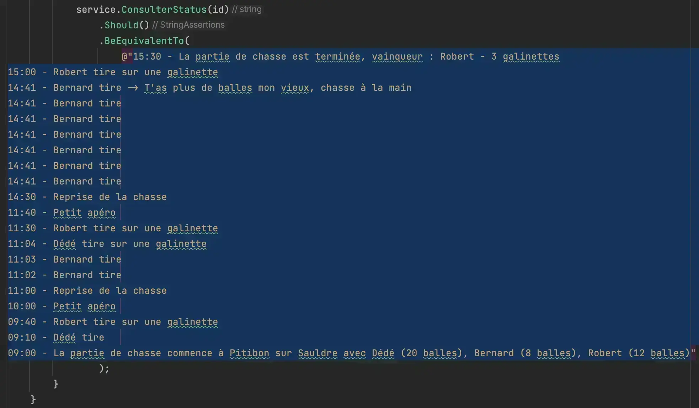
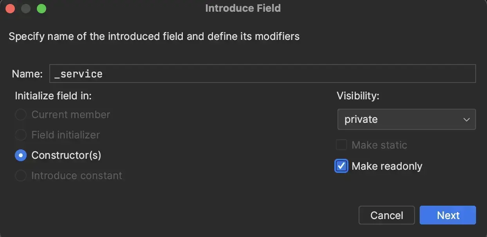
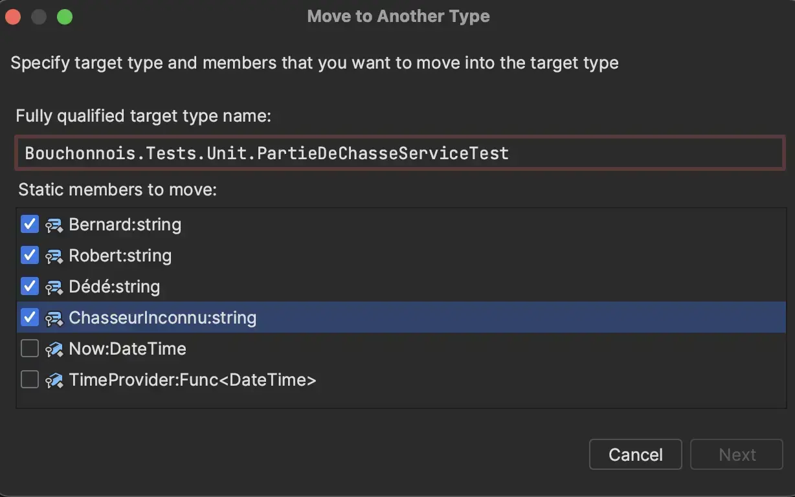

# "Approve Everything"
Il y a quelques tests pour lesquels nous avons énormément de lignes d'assertions. 
Nous allons les retravailler afin de les transformer en `Approval Tests`.

- Prendre du temps pour comprendre ce qui se cache derrière cette notion d'[Approval Testing](https://github.com/ythirion/approval-testing-kata#2-approval-testing)
- Identifier des tests sur lesquels on pourrait utiliser cette technique
- Refactorer un test existant en utilisant la librairie [Verify](https://github.com/VerifyTests/Verify)

## Identification des tests
On pourrait utiliser cette technique pour les tests suivants :
- `DemarrerUnePartieDeChasse.AvecPlusieursChasseurs`
  - Limitera les asserts à une seule ligne
  - Moins de maintenance et assertions plus lisibles
- `ConsulterStatus` : `QuandLaPartieVientDeDémarrer` / `QuandLaPartieEstTerminée`
- `ScenarioTests.DéroulerUnePartie`
  - On valide le contenu d'un `string`
  - Cela évitera de stocker ce string dans le code (sera stocké sous forme de ressource)

## Refactorer `ScenarioTests.DéroulerUnePartie`
- On commence par ajouter la dépendance sur notre librairie d'Approval Testing

```shell
dotnet add package Verify.xUnit
```

- On peut ensuite extraire le contenu de l'assertion dans un fichier "Approved" ici "verified"
  - On crée un fichier appelé : `ScenarioTests.DéroulerUnePartie.verified.txt` (`[Nom de la classe de tests].[Nom du test].verified.txt`)
  - C'est sur base de ce fichier que l'assertion se fera via `Verify`


- On transforme le test en `Approval Test` en
  - Ajoutant l'annotation `UsesVerify` sur la classe de test
  - Changeant la méthode de test pour que celle-ci renvoie une `Task`

```csharp
[UsesVerify]
public class ScenarioTests
{
    [Fact]
    public Task DéroulerUnePartie()
    {
        var time = new DateTime(2024, 4, 25, 9, 0, 0);
        var repository = new PartieDeChasseRepositoryForTests();
        var service = new PartieDeChasseService(repository, () => time);
        var chasseurs = new List<(string, int)>
        {
            ("Dédé", 20),
            ("Bernard", 8),
            ("Robert", 12)
        };
        var terrainDeChasse = ("Pitibon sur Sauldre", 4);
        var id = service.Demarrer(
            terrainDeChasse,
            chasseurs
        );

        time = time.Add(TimeSpan.FromMinutes(10));
        service.Tirer(id, "Dédé");

        time = time.Add(TimeSpan.FromMinutes(30));
        service.TirerSurUneGalinette(id, "Robert");

        time = time.Add(TimeSpan.FromMinutes(20));
        service.PrendreLapéro(id);

        time = time.Add(TimeSpan.FromHours(1));
        service.ReprendreLaPartie(id);

        time = time.Add(TimeSpan.FromMinutes(2));
        service.Tirer(id, "Bernard");

        time = time.Add(TimeSpan.FromMinutes(1));
        service.Tirer(id, "Bernard");

        time = time.Add(TimeSpan.FromMinutes(1));
        service.TirerSurUneGalinette(id, "Dédé");

        time = time.Add(TimeSpan.FromMinutes(26));
        service.TirerSurUneGalinette(id, "Robert");

        time = time.Add(TimeSpan.FromMinutes(10));
        service.PrendreLapéro(id);

        time = time.Add(TimeSpan.FromMinutes(170));
        service.ReprendreLaPartie(id);

        time = time.Add(TimeSpan.FromMinutes(11));
        service.Tirer(id, "Bernard");

        time = time.Add(TimeSpan.FromSeconds(1));
        service.Tirer(id, "Bernard");

        time = time.Add(TimeSpan.FromSeconds(1));
        service.Tirer(id, "Bernard");

        time = time.Add(TimeSpan.FromSeconds(1));
        service.Tirer(id, "Bernard");

        time = time.Add(TimeSpan.FromSeconds(1));
        service.Tirer(id, "Bernard");

        time = time.Add(TimeSpan.FromSeconds(1));
        service.Tirer(id, "Bernard");

        time = time.Add(TimeSpan.FromSeconds(1));

        try
        {
            service.Tirer(id, "Bernard");
        }
        catch (TasPlusDeBallesMonVieuxChasseALaMain)
        {
        }

        time = time.Add(TimeSpan.FromMinutes(19));
        service.TirerSurUneGalinette(id, "Robert");

        time = time.Add(TimeSpan.FromMinutes(30));
        service.TerminerLaPartie(id);

        // retourne le résultat de la méthode `Verify`
        return Verify(service.ConsulterStatus(id));
    }
}
```

Le test passe du premier coup 👌

On va faire en sorte de le faire passer au rouge : `ne jamais croire un test qu'on a pas vu échouer`...

Pour celà le plus simple est de changer le fichier `verified`.

Notre `Approval Test` échoue, notre outil de comparaison de fichier va s'ouvrir :


Dès lors nous avons une arborescence de fichiers ressemblant à celà :


Un élément important quand on utilise une librairie de ce genre, ajouter les fichiers `received` dans le fichier `.gitignore` :

```text
# Verify
*.received.txt
```

Félicitations, notre premier test passe et on peut se fier à lui.

En revanche, le test n'est pas très lisible / maintenable :
- Beaucoup de duplication
- `try / catch` vide
- Méthode de plus de `80 loc`

On va y appliquer la fameuse [règle du boyscout](https://deviq.com/principles/boy-scout-rule).


### Boy Scout Rule
- On commence par extraire des champs à partir du test via notre `IDE`


- Puis on configure l'extraction


- Le résultat est :
```csharp
public class ScenarioTests
{
    private DateTime _time = new(2024, 4, 25, 9, 0, 0);
    private readonly PartieDeChasseService _service;

    public ScenarioTests()
    {
        _service = new PartieDeChasseService(
            new PartieDeChasseRepositoryForTests(),
            () => _time
        );
    }
    ....
}
```

- On va utiliser le `CommandBuilder` également
  - Afin de supprimer les `string` hardcodés

```csharp
var command = DémarrerUnePartieDeChasse()
    .Avec(("Dédé", 20), ("Bernard", 8), ("Robert", 12))
    .SurUnTerrainRicheEnGalinettes(4);

var id = _service.Demarrer(
    command.Terrain,
    command.Chasseurs
);
```

- On va ensuite supprimer la duplication en faisant une extraction des constantes : `Bernard`, `Robert`, `Dédé`, `ChasseurInconnu`
  - Pour pouvoir les utiliser dans cette classe de test également
  - On les place dans un fichier `Data`



- Notre test ressemble désormais à celà

```csharp
[Fact]
public Task DéroulerUnePartie()
{
    var command = DémarrerUnePartieDeChasse()
        .Avec((Data.Dédé, 20), (Data.Bernard, 8), (Data.Robert, 12))
        .SurUnTerrainRicheEnGalinettes(4);

    var id = _service.Demarrer(
        command.Terrain,
        command.Chasseurs
    );

    _time = _time.Add(TimeSpan.FromMinutes(10));
    _service.Tirer(id, Data.Dédé);

    _time = _time.Add(TimeSpan.FromMinutes(30));
    _service.TirerSurUneGalinette(id, Data.Robert);
    
    ....
}
```

## Reflect
- Que pensez vous de cette technique ?
  - Quels autres cas d'utilisation pouvez-vous identifier ?
- Qu'est-ce que le `scrubbing` ?

