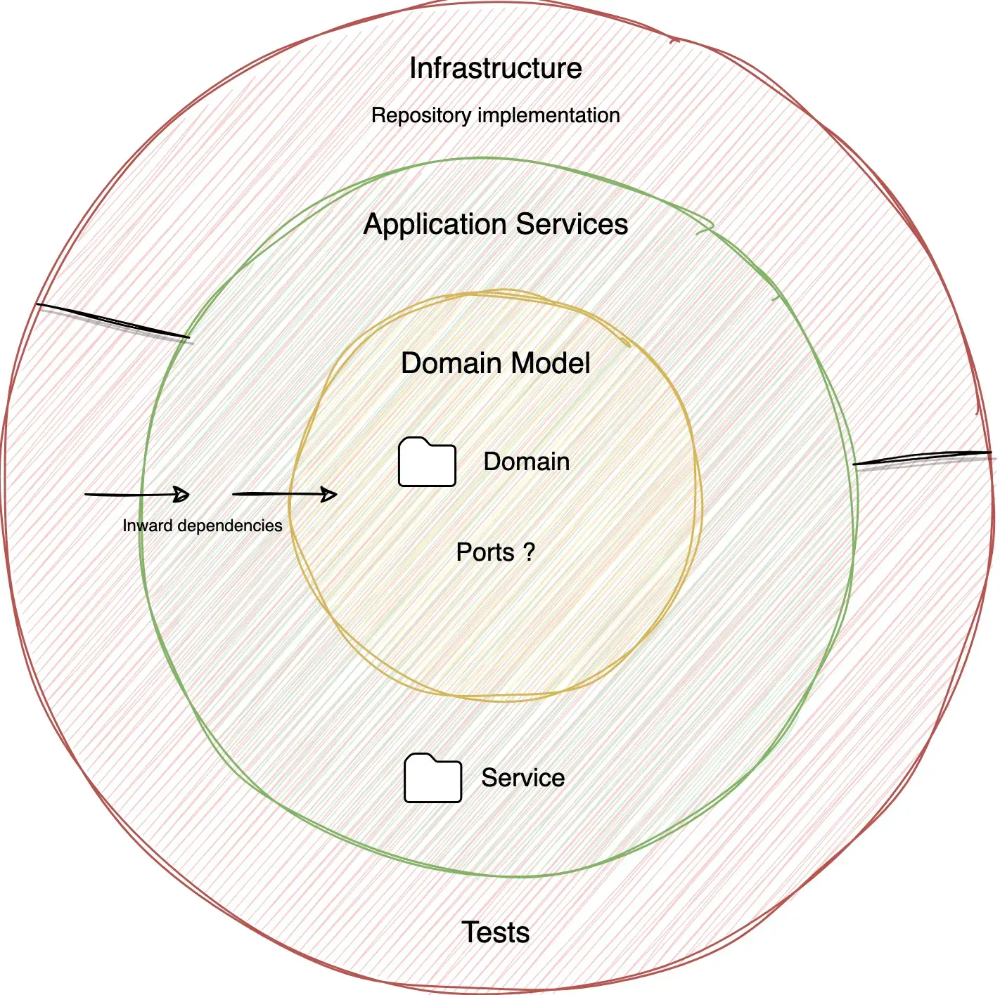

# Tests d'architecture
Avec toutes les découvertes réalisées jusqu'à présent on a pu se rendre compte que l'architecture désirée était une architecture en `Onion` :


On va s'assurer que le code actuel respecte le Design escompté :
- Prendre du temps pour comprendre ce que sont des [`Architecture Unit Tests`](https://xtrem-tdd.netlify.app/Flavours/archunit)
- Ecrire des tests d'architecture en utilisant la librairie [ArchUnit](https://github.com/TNG/ArchUnitNET/)

Pour aller plus vite, voici une classe contenant des extensions facilitant l'écriture et le lancement de tels tests :

```csharp
using ArchUnitNET.Fluent;
using ArchUnitNET.Fluent.Syntax.Elements.Types;
using ArchUnitNET.Loader;
using ArchUnitNET.xUnit;
using Bouchonnois.Service;
using static ArchUnitNET.Fluent.ArchRuleDefinition;

namespace Bouchonnois.Tests.Architecture
{
    public static class ArchUnitExtensions
    {
        private static readonly ArchUnitNET.Domain.Architecture Architecture =
            new ArchLoader()
                .LoadAssemblies(typeof(PartieDeChasseService).Assembly)
                .Build();

        public static GivenTypesConjunction TypesInAssembly() =>
            Types().That().Are(Architecture.Types);

        public static void Check(this IArchRule rule) => rule.Check(Architecture);
    }
    
    // Exemple de test
    public class Guidelines
    {
        private static GivenMethodMembersThat Methods() => MethodMembers().That().AreNoConstructors().And();

        [Fact]
        public void NoGetMethodShouldReturnVoid() =>
            Methods()
                .HaveName("Get[A-Z].*", useRegularExpressions: true).Should()
                .NotHaveReturnType(typeof(void))
                .Check();
    }
}
```

## Inward Dependencies
On va valider le sens des dépendances en ajoutant une nouvelle classe de tests
```csharp
public class ArchitectureRules
{
    [Fact]
    public void ApplicationServicesRules() =>
    {
        // Les classes dans l'Application Services ne devraient pas dépendre de classes dans Infrastructure   
    }
        
    [Fact]
    public void InfrastructureRules() 
    {
        // Quelles sont les classes de l'infrastructure ?
        // Que devrions nous faire de ce qui est contenu dans Infra ?
    }

    [Fact]
    public void DomainModelRules() 
    {
        // Les classes dans Domain ne devraient pas dépendre de classes dans Infrastructure ou Application Services
    }
}
```

On définit les couches de notre `onion` :
```csharp
private static GivenTypesConjunctionWithDescription ApplicationServices() =>
    TypesInAssembly().And()
        .ResideInNamespace("Service", true)
        .As("Application Services");

private static GivenTypesConjunctionWithDescription DomainModel() =>
    TypesInAssembly().And()
        .ResideInNamespace("Domain", true)
        .As("Domain Model");

private static GivenTypesConjunctionWithDescription Infrastructure() =>
    TypesInAssembly().And()
        .ResideInNamespace("Repository", true)
        .As("Infrastructure");
```

### Domain Model
On peut alors écrire une première règle pour notre `Domain Model` :

```csharp
[Fact]
public void DomainModelRules() =>
    DomainModel().Should()
        .NotDependOnAny(ApplicationServices()).AndShould()
        .NotDependOnAny(Infrastructure())
        .Check();
```

Celle-ci échoue :


La classe `Terrain` se trouve dans l'Application Services alors qu'elle est une entité à part entière du `Domain`...

On corrige celà en déplaçant la classe :


### Règle de l'Application Services
On en profite pour implémenter une règle sur l'Application Service :
```csharp
[Fact]
public void ApplicationServicesRules() =>
    Infrastructure().Should()
        .NotDependOnAny(Infrastructure())
        .Check();
```

### Quid de l'infrastructure ?
Pour le moment nous n'avons qu'une interface de `Repository` (Un Port) au sein du namespace `Infrastructure'.
Est-ce que celà fait du sens au regard de la règle de dépendance ?

Nous allons déplacer ce `port` dans le `Domain`.

Nous pouvons tout de même implémenter une règle spécifiant que les items présents dans le namespace `Repository` doit implémenter l'interface `IPartieDeChasseRepository` :
```csharp
[Fact]
public void InfrastructureRules() =>
    Infrastructure().Should()
        .ImplementInterface(typeof(IPartieDeChasseRepository))
        .Check();
```

## Règles d'équipe
On peut ajouter certaines règles d'équipe du genre :
- Toutes les interfaces doivent commencer par `I`
- Une méthode commençant par `Get` doit retourner quelque chose
- ...

```csharp
 public class Guidelines
{
    private static GivenMethodMembersThat Methods() => MethodMembers().That().AreNoConstructors().And();

    [Fact]
    public void NoGetMethodShouldReturnVoid() =>
        Methods()
            .HaveName("Get[A-Z].*", useRegularExpressions: true).Should()
            .NotHaveReturnType(typeof(void))
            .Check();

    [Fact]
    public void IserAndHaserShouldReturnBooleans() =>
        Methods()
            .HaveName("Is[A-Z].*", useRegularExpressions: true).Or()
            .HaveName("Has[A-Z].*", useRegularExpressions: true).Should()
            .HaveReturnType(typeof(bool))
            .Check();

    [Fact]
    public void SettersShouldNotReturnSomething() =>
        Methods()
            .HaveName("Set[A-Z].*", useRegularExpressions: true).Should()
            .HaveReturnType(typeof(void))
            .Check();

    [Fact]
    public void InterfacesShouldStartWithI() =>
        Interfaces().Should()
            .HaveName("^I[A-Z].*", useRegularExpressions: true)
            .Because("C# convention...")
            .Check();
}
```

Nouveau rapport `SonarCloud` disponible [ici](https://sonarcloud.io/summary/overall?id=ythirion_refactoring-du-bouchonnois&branch=steps%2F07-architecture-tests).

## Reflect
- A quoi cette technique pourrait vous servir ?
- Quelles règles pourraient être utiles dans votre quotidien ?

