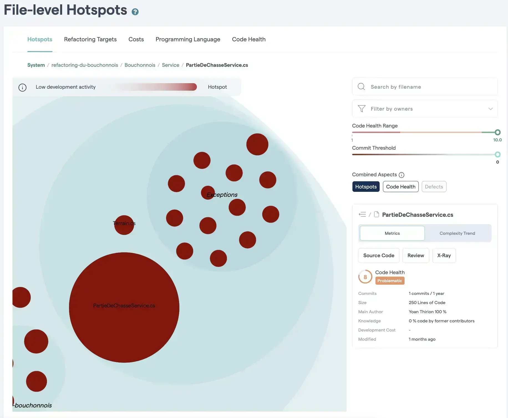
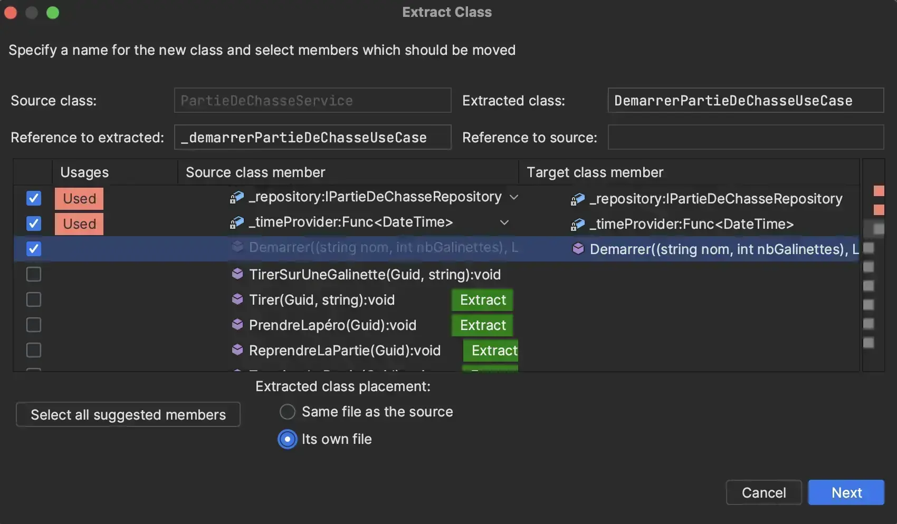
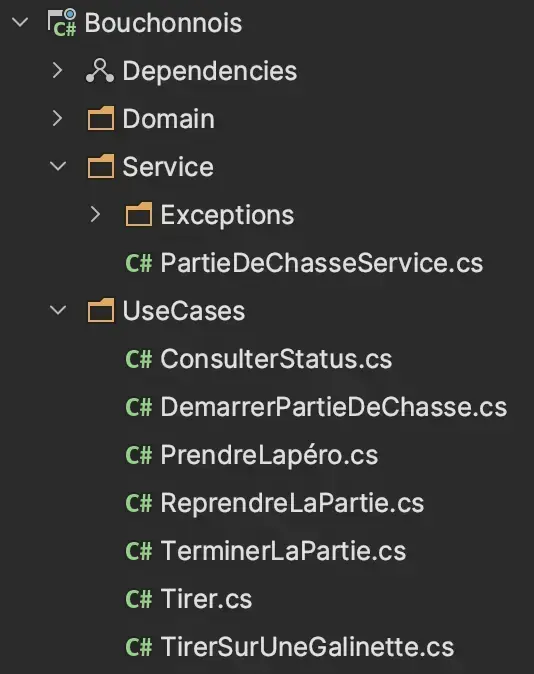
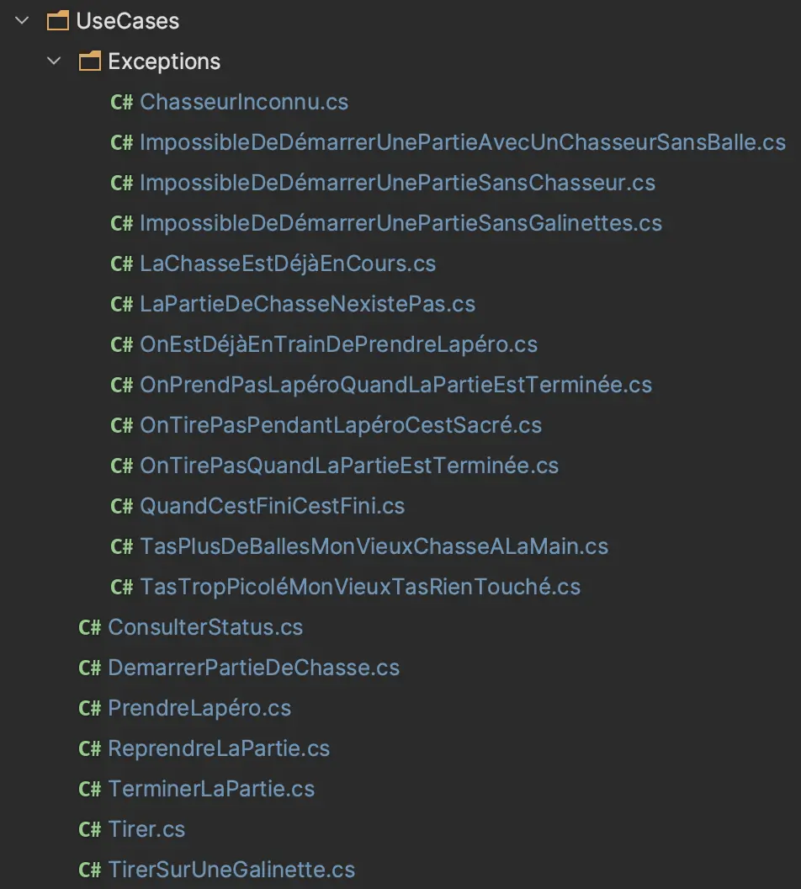
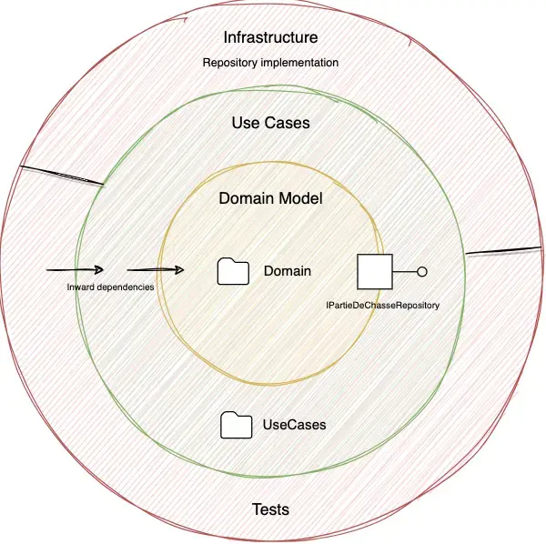
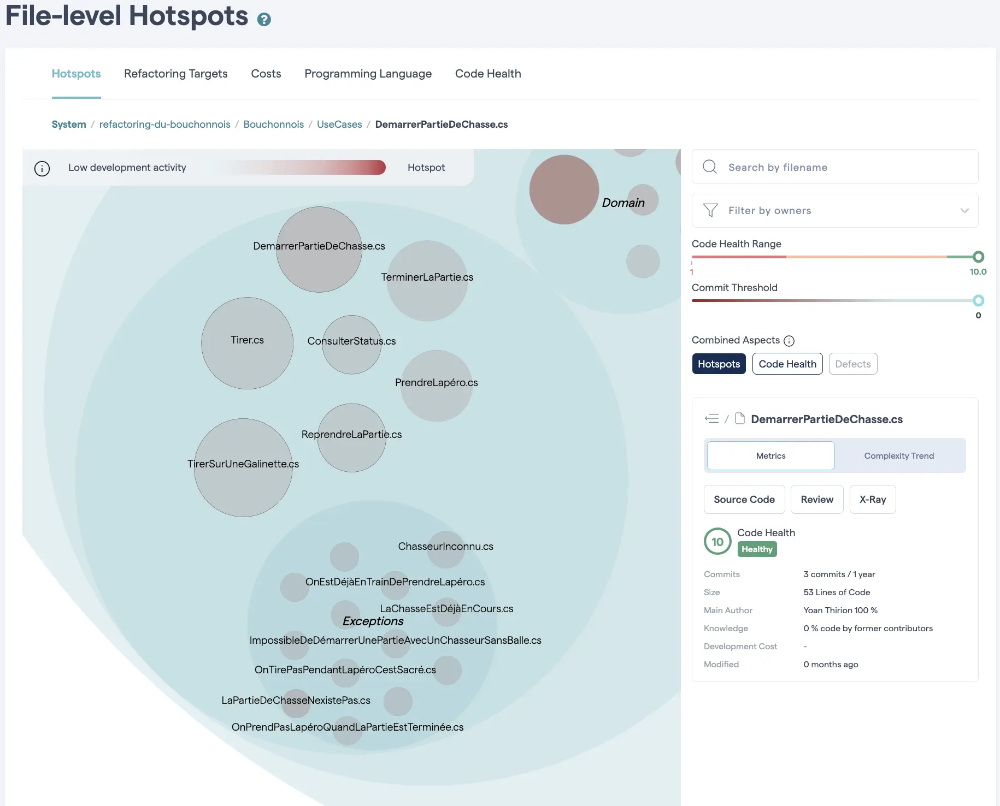

# Use Cases
Maintenant que nous sommes confiants vis-à-vis de nos tests nous allons pouvoir commencer à refactorer.
Nous pouvons démarrer en `splittant` notre principal hostpot : `PartieDeChasseService`.



Pour ce faire, nous allons utiliser la stratégie `Divide and Conquer` :
- Prendre du temps pour comprendre ce qu'est la [`Clean Architecture`](https://xtrem-tdd.netlify.app/Flavours/clean-architecture)
  - Notamment la notion de `Use Case`
- Extraire 1 `Use Case` par méthode du `Service`
- Améliorer la définition de notre architecture via nos tests `Archunit`

## Extraire un premier Use Case
- Utiliser les fonctionnalités de notre `IDE` pour extraire la méthode `Démarrer`
  - `Refactor` -> `Extract` -> `Extract Class`
  - Penser à configurer l'extraction de la méthode en `Create delegating Wrapper`



- Voici le résultat :

```csharp
public class DemarrerPartieDeChasseUseCase
{
    private readonly IPartieDeChasseRepository _repository;
    private readonly Func<DateTime> _timeProvider;

    public DemarrerPartieDeChasseUseCase(IPartieDeChasseRepository repository, Func<DateTime> timeProvider)
    {
        _repository = repository;
        _timeProvider = timeProvider;
    }

    public Guid Demarrer((string nom, int nbGalinettes) terrainDeChasse, List<(string nom, int nbBalles)> chasseurs)
    {
        if (terrainDeChasse.nbGalinettes <= 0)
        {
            throw new ImpossibleDeDémarrerUnePartieSansGalinettes();
        }

        var partieDeChasse =
            new PartieDeChasse(Guid.NewGuid(),
                new Terrain(terrainDeChasse.nom)
                {
                    NbGalinettes = terrainDeChasse.nbGalinettes
                }
            );

        foreach (var chasseur in chasseurs)
        {
            if (chasseur.nbBalles == 0)
            {
                throw new ImpossibleDeDémarrerUnePartieAvecUnChasseurSansBalle();
            }

            partieDeChasse.Chasseurs.Add(new Chasseur(chasseur.nom)
            {
                BallesRestantes = chasseur.nbBalles
            });
        }

        if (partieDeChasse.Chasseurs.Count == 0)
        {
            throw new ImpossibleDeDémarrerUnePartieSansChasseur();
        }

        string chasseursToString = string.Join(
            ", ",
            partieDeChasse.Chasseurs.Select(c => c.Nom + $" ({c.BallesRestantes} balles)")
        );

        partieDeChasse.Events.Add(new Event(_timeProvider(),
            $"La partie de chasse commence à {partieDeChasse.Terrain.Nom} avec {chasseursToString}")
        );

        _repository.Save(partieDeChasse);

        return partieDeChasse.Id;
    }
}
```

- La classe `PartieDeChasseService` délègue maintenant les appels de la méthode `Démarrer` à notre `Use Case`
  - Ainsi, nous compilons et nos tests sont toujours au vert

```csharp
public Guid Demarrer((string nom, int nbGalinettes) terrainDeChasse, List<(string nom, int nbBalles)> chasseurs)
        => _demarrerPartieDeChasseUseCase.Demarrer(terrainDeChasse, chasseurs);
```

- On adapte les tests de ce `Use Case`

```csharp
namespace Bouchonnois.Tests.Unit
{
    [UsesVerify]
    public class DemarrerUnePartieDeChasse : PartieDeChasseServiceTest
    {
        // On appelle le Use Case et non plus le Service 
        private readonly DemarrerPartieDeChasse _useCase;

        public DemarrerUnePartieDeChasse()
        {
            _useCase = new DemarrerPartieDeChasse(Repository, TimeProvider);
        }

        [Fact]
        public Task AvecPlusieursChasseurs()
        {
            var command = DémarrerUnePartieDeChasse()
                .Avec((Data.Dédé, 20), (Data.Bernard, 8), (Data.Robert, 12))
                .SurUnTerrainRicheEnGalinettes();

            _useCase.Handle(
                command.Terrain,
                command.Chasseurs
            );

            return Verify(Repository.SavedPartieDeChasse())
                .DontScrubDateTimes();
        }

        [Property]
        public Property Sur1TerrainAvecGalinettesEtChasseursAvecTousDesBalles() =>
            ForAll(
                terrainRicheEnGalinettesGenerator(),
                chasseursAvecBallesGenerator(),
                (terrain, chasseurs) => DémarreLaPartieAvecSuccès(terrain, chasseurs));

        private bool DémarreLaPartieAvecSuccès((string nom, int nbGalinettes) terrain,
            IEnumerable<(string nom, int nbBalles)> chasseurs)
            => _useCase.Handle(
                terrain,
                chasseurs.ToList()) == Repository.SavedPartieDeChasse()!.Id;

        public class Echoue : DemarrerUnePartieDeChasse
        {
            [Property]
            public Property SansChasseursSurNimporteQuelTerrainRicheEnGalinette()
                => ForAll(
                    terrainRicheEnGalinettesGenerator(),
                    terrain =>
                        EchoueAvec<ImpossibleDeDémarrerUnePartieSansChasseur>(
                            terrain,
                            PasDeChasseurs,
                            savedPartieDeChasse => savedPartieDeChasse == null)
                );

            [Property]
            public Property AvecUnTerrainSansGalinettes()
                => ForAll(
                    terrainSansGalinettesGenerator(),
                    chasseursAvecBallesGenerator(),
                    (terrain, chasseurs) =>
                        EchoueAvec<ImpossibleDeDémarrerUnePartieSansGalinettes>(
                            terrain,
                            chasseurs.ToList(),
                            savedPartieDeChasse => savedPartieDeChasse == null)
                );

            [Property]
            public Property SiAuMoins1ChasseurSansBalle() =>
                ForAll(
                    terrainRicheEnGalinettesGenerator(),
                    chasseursSansBallesGenerator(),
                    (terrain, chasseurs) =>
                        EchoueAvec<ImpossibleDeDémarrerUnePartieAvecUnChasseurSansBalle>(
                            terrain,
                            chasseurs.ToList(),
                            savedPartieDeChasse => savedPartieDeChasse == null)
                );

            private bool EchoueAvec<TException>(
                (string nom, int nbGalinettes) terrain,
                IEnumerable<(string nom, int nbBalles)> chasseurs,
                Func<PartieDeChasse?, bool>? assert = null) where TException : Exception
                => MustFailWith<TException>(() => _useCase.Handle(terrain, chasseurs.ToList()), assert);
        }
    }
}
```

> Répliquer celà pour tous les Use Cases

A la fin, le `PartieDeChasseService` ressemble à celà :
```csharp
public class PartieDeChasseService
{
    private readonly IPartieDeChasseRepository _repository;
    private readonly DemarrerPartieDeChasse _demarrerPartieDeChasse;
    private readonly TirerSurUneGalinette _tirerSurUneGalinette;
    private readonly Tirer _tirer;
    private readonly PrendreLapéro _prendreLapéro;
    private readonly ReprendreLaPartie _reprendreLaPartie;
    private readonly TerminerLaPartie _terminerLaPartie;
    private readonly ConsulterStatus _consulterStatus;

    public PartieDeChasseService(
        IPartieDeChasseRepository repository,
        Func<DateTime> timeProvider)
    {
        _repository = repository;

        _consulterStatus = new ConsulterStatus(repository);
        _terminerLaPartie = new TerminerLaPartie(repository, timeProvider);
        _reprendreLaPartie = new ReprendreLaPartie(repository, timeProvider);
        _prendreLapéro = new PrendreLapéro(repository, timeProvider);
        _tirer = new Tirer(repository, timeProvider);
        _tirerSurUneGalinette = new TirerSurUneGalinette(repository, timeProvider);
        _demarrerPartieDeChasse = new DemarrerPartieDeChasse(repository, timeProvider);
    }

    public Guid Demarrer((string nom, int nbGalinettes) terrainDeChasse, List<(string nom, int nbBalles)> chasseurs)
        => _demarrerPartieDeChasse.Handle(terrainDeChasse, chasseurs);

    public void TirerSurUneGalinette(Guid id, string chasseur)
        => _tirerSurUneGalinette.Handle(id, chasseur);

    public void Tirer(Guid id, string chasseur) => _tirer.Handle(id, chasseur);

    public void PrendreLapéro(Guid id) => _prendreLapéro.Handle(id);

    public void ReprendreLaPartie(Guid id) => _reprendreLaPartie.Handle(id);

    public string TerminerLaPartie(Guid id) => _terminerLaPartie.Handle(id);

    public string ConsulterStatus(Guid id) => _consulterStatus.Handle(id);
}
```

### Supprimer le service
- L'arborescence de notre projet ressemble désormais à celà :



- Il ne reste plus qu'un seul appelant du srvice `PartieDeChasseService` -> `ScenarioTests` 
- Nous allons rediriger les appels des tests vers les `Use Case`

```csharp
namespace Bouchonnois.Tests.Acceptance
{
    [UsesVerify]
    public class ScenarioTests
    {
        private DateTime _time = new(2024, 4, 25, 9, 0, 0);

        private readonly DemarrerPartieDeChasse _demarrerPartieDeChasse;
        private readonly Tirer _tirer;
        private readonly TirerSurUneGalinette _tirerSurUneGalinette;
        private readonly PrendreLapéro _prendreLapéro;
        private readonly ReprendreLaPartie _reprendreLaPartie;
        private readonly TerminerLaPartie _terminerLaPartie;
        private readonly ConsulterStatus _consulterStatus;

        public ScenarioTests()
        {
            var repository = new PartieDeChasseRepositoryForTests();
            var timeProvider = () => _time;

            _demarrerPartieDeChasse = new DemarrerPartieDeChasse(repository, timeProvider);
            _tirer = new Tirer(repository, timeProvider);
            _tirerSurUneGalinette = new TirerSurUneGalinette(repository, timeProvider);
            _prendreLapéro = new PrendreLapéro(repository, timeProvider);
            _reprendreLaPartie = new ReprendreLaPartie(repository, timeProvider);
            _terminerLaPartie = new TerminerLaPartie(repository, timeProvider);
            _consulterStatus = new ConsulterStatus(repository);
        }

        [Fact]
        public Task DéroulerUnePartie()
        {
            var command = DémarrerUnePartieDeChasse()
                .Avec((Data.Dédé, 20), (Data.Bernard, 8), (Data.Robert, 12))
                .SurUnTerrainRicheEnGalinettes(4);

            var id = _demarrerPartieDeChasse.Handle(
                command.Terrain,
                command.Chasseurs
            );

            After(10.Minutes(), () => _tirer.Handle(id, Data.Dédé));
            After(30.Minutes(), () => _tirerSurUneGalinette.Handle(id, Data.Robert));
            After(20.Minutes(), () => _prendreLapéro.Handle(id));
            After(1.Hours(), () => _reprendreLaPartie.Handle(id));
            After(2.Minutes(), () => _tirer.Handle(id, Data.Bernard));
            After(1.Minutes(), () => _tirer.Handle(id, Data.Bernard));
            After(1.Minutes(), () => _tirerSurUneGalinette.Handle(id, Data.Dédé));
            After(26.Minutes(), () => _tirerSurUneGalinette.Handle(id, Data.Robert));
            After(10.Minutes(), () => _prendreLapéro.Handle(id));
            After(170.Minutes(), () => _reprendreLaPartie.Handle(id));
            After(11.Minutes(), () => _tirer.Handle(id, Data.Bernard));
            After(1.Seconds(), () => _tirer.Handle(id, Data.Bernard));
            After(1.Seconds(), () => _tirer.Handle(id, Data.Bernard));
            After(1.Seconds(), () => _tirer.Handle(id, Data.Bernard));
            After(1.Seconds(), () => _tirer.Handle(id, Data.Bernard));
            After(1.Seconds(), () => _tirer.Handle(id, Data.Bernard));
            After(1.Seconds(), () => _tirer.Handle(id, Data.Bernard));
            After(19.Minutes(), () => _tirerSurUneGalinette.Handle(id, Data.Robert));
            After(30.Minutes(), () => _terminerLaPartie.Handle(id));

            return Verify(_consulterStatus.Handle(id));
        }
        ...
    }
}
```

- On peut maintenant supprimer la classe `PartieDeChasseService` de manière totalement `safe`


- On place l'ensemble des `Exceptions` au plus proche de leur utilisation (dans le namespace `UseCases`)



> Notre architecture ressemble maintenant à ça



## Mise à jour des règles ArchUnit
```csharp
public class ArchitectureRules
{
    private static GivenTypesConjunctionWithDescription UseCases() =>
        TypesInAssembly().And()
            .ResideInNamespace("UseCases", true)
            .As("Use Cases");

    private static GivenTypesConjunctionWithDescription Infrastructure() =>
        TypesInAssembly().And()
            .ResideInNamespace("Repository", true)
            .As("Infrastructure");

    [Fact]
    public void UseCasesRules() =>
        UseCases().Should()
            .NotDependOnAny(Infrastructure())
            .Check();
      
    ...
```

## Impact sur l'analyse comportementale
Après avoir extrait les `Use Cases`, nous avons "tué" le hotspot identifié par `codescene` :


Nous avons simplement divisé cette grosse classe "fourre-tout" en plus petites unités, avec des dépendances clairement identifiées qu'on va pouvoir tranquillement refactorer.

Nouveau rapport `SonarCloud` disponible [ici](https://sonarcloud.io/summary/overall?id=ythirion_refactoring-du-bouchonnois&branch=steps%2F08-use-cases).

## Reflect
- Quel est l'impact sur le design ? les tests ?
- En quoi pouvons nous parler ici de `Screaming Architecture` ?

