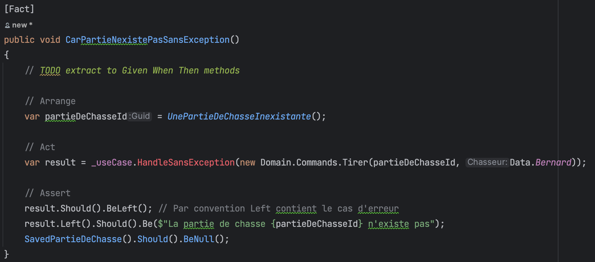

# "Avoid Exceptions"
`Quel est le problème avec ce code ?`

```csharp
tirerUseCase.Handle(new Domain.Commands.Tirer(id, Data.Bernard));

public TResponse Handle(TRequest command)
{
    var partieDeChasse = _repository.GetById(command.PartieDeChasseId);

    if (partieDeChasse == null)
    {
        throw new LaPartieDeChasseNexistePas();
    }

    var response = _handler(partieDeChasse, command);
    _repository.Save(partieDeChasse);

    return response;
}
```

Si on regarde la signature de la méthode `Handle` : 
- `TRequest` -> `TResponse`
  - Que l'on peut traduire par : `Pour tout TRequest je te retourne 1 TResponse`
  - Ce qui est faux puisque cette méthode et la méthode d'handling peuvent lancer des exceptions
- La signature de cette méthode ne représente pas de manière explicite les sorties possibles de cette dernière

Souvent notre code contient ce genre de `mensonges`... 

Pour aller plus loin sur ce sujet je t'invite à regarder la super conférence de [Scott Wlaschin](https://www.linkedin.com/in/scottwlaschin/) sur le sujet : [Functional Design Patterns](https://youtu.be/srQt1NAHYC0).

Nous allons chercher à rendre ce code plus explicite en :
- Évitant l'utilisation à outrance des `Exception`
  - Elles sont beaucoup trop utilisés pour représenter des cas d'erreurs business sous contrôles
- Les remplaçant par des retours de type `Error`
- Utilisant les fameuses `Monads`

## Comment ?
- Prendre du temps pour lire ces pages :
  - [Avoid Exceptions](https://xtrem-tdd.netlify.app/Flavours/avoid-exceptions)
  - [Monads](https://xtrem-tdd.netlify.app/Flavours/monads)
- À l'aide de `T.D.D` et du `Strangler` pattern, refactorer le `Use Case` `Tirer` afin que la signature de `Handle` ressemble à :
  - `TRequest` -> `Either<Error, TResponse>`
  - soit `Commands.Tirer` -> `Either<Error, VoidResponse>`
    - On limitera le type `Error` à 1 message décrivant l'erreur qui s'est produite

## Le `Use Case` : `Tirer`
:red_circle: On commence par écrire 1 test qui échoue

- On y décrit nos attentes vis-à vis de la future méthode

```csharp
[Fact]
public void CarPartieNexistePasSansException()
{
    // TODO extract to Given When Then methods
    
    // Arrange
    var partieDeChasseId = UnePartieDeChasseInexistante();
    
    // Act
    var result = _useCase.HandleSansException(new Domain.Commands.Tirer(partieDeChasseId, Data.Bernard));
    
    // Assert
    result.Should().BeLeft(); // Par convention Left contient le cas d'erreur
    result.Left().Should().Be($"La partie de chasse {partieDeChasseId} n'existe pas");
    SavedPartieDeChasse().Should().BeNull();
}
```

- On ne compile pas et donc le test échoue


- On génère depuis le test le code de la méthode ``

```csharp
public Either<Error, VoidResponse> HandleSansException(Domain.Commands.Tirer command) => throw new NotImplementedException();
```

- On ajoute les références nous permettant d'utiliser des monades existantes : [`LanguageExt`](https://github.com/louthy/language-ext)

```shell
dotnet add package "LanguageExt.Core"
dotnet add package "FluentAssertions.LanguageExt"
```

- On doit maintenant générer la classe `Error`


```csharp
public record Error(string Message);
```

- On "fixe" les assertions du test pour pouvoir compiler

```csharp
[Fact]
public void CarPartieNexistePasSansException()
{
    // TODO extract to Given When Then methods

    // Arrange
    var partieDeChasseId = UnePartieDeChasseInexistante();

    // Act
    var result = _useCase.HandleSansException(new Domain.Commands.Tirer(partieDeChasseId, Data.Bernard));

    // Assert
    result.Should().BeLeft(); // Par convention Left contient le cas d'erreur
    result.IfLeft(error =>
    {
        error.Message.Should().Be($"La partie de chasse {partieDeChasseId} n'existe pas");
        SavedPartieDeChasse().Should().BeNull();
    });
}
```

- On est maintenant au `rouge` pour une bonne raison


:green_circle: On fait passer le test au vert le plus rapidement possible

```csharp
public Either<Error, VoidResponse> HandleSansException(Domain.Commands.Tirer command) => new Error($"La partie de chasse {command.PartieDeChasseId} n'existe pas");
```

- Ici on peut retourner directement 1 `Error` grâce à l'import de `namespace` ci-dessous et l'implicit conversion :

```csharp
using static LanguageExt.Prelude;
```


:large_blue_circle: Qu'est-ce qui peut être amélioré ici ?

TODO utiliser `AnError` factory method

## Reflect
- Qu'est-ce que vous pensez des `Monads` ?
- Quel est leur impact sur notre code ?
- Quel impact ce refactoring a eu ?

